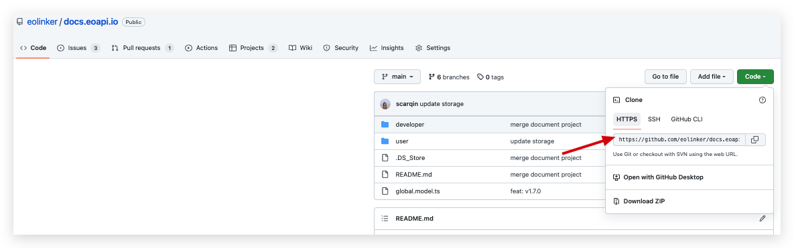
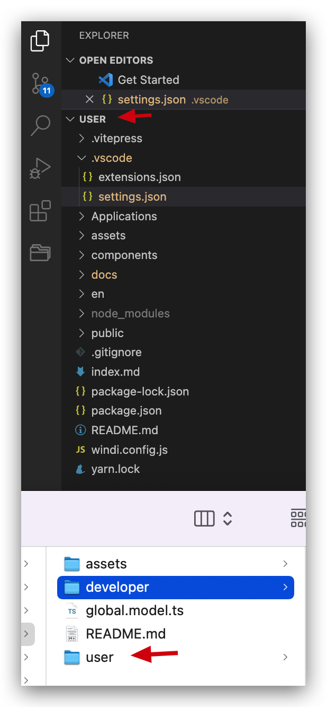
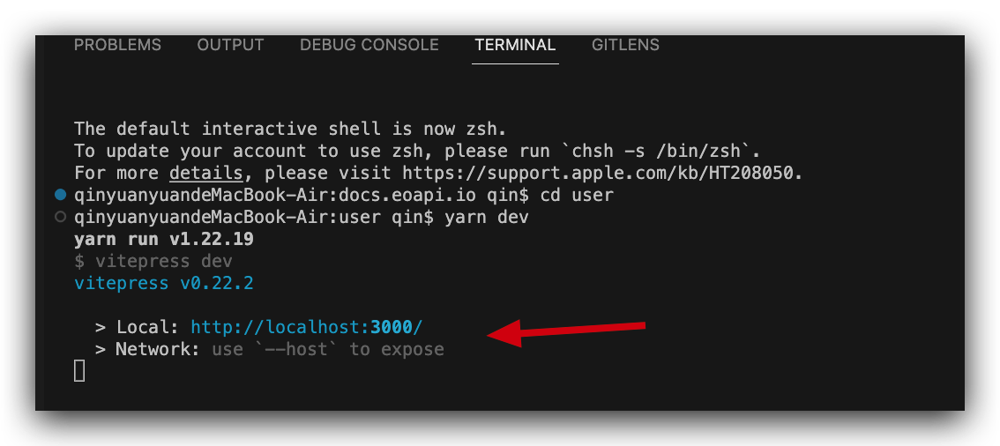
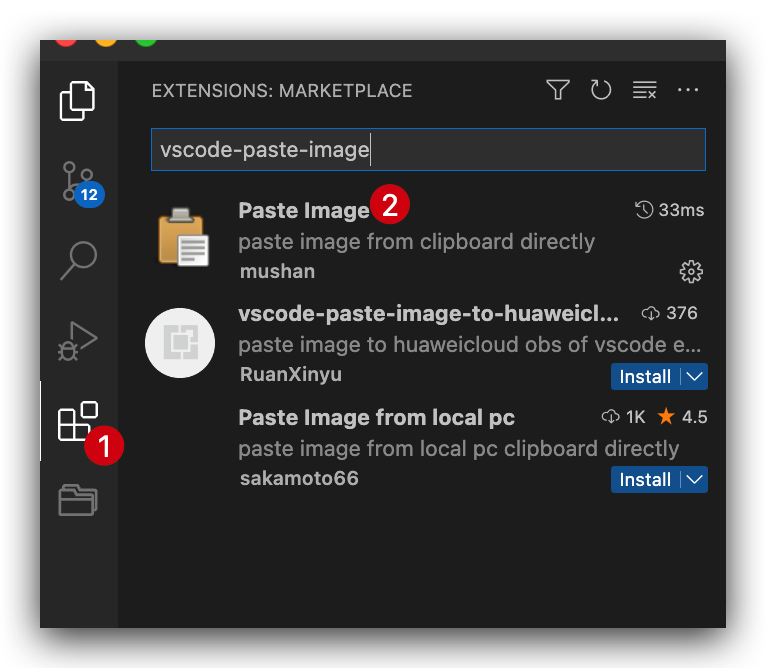

# README

本文档由 [VitePress](https://vitepress.vuejs.org/) 搭建，开始之前你需要了解以下知识：

# 项目结构

```bash
├── user					# 用户文档：https://docs.eoapi.io/
├── developer			    # 开发者文档：https://developer.eoapi.io/
```

每个目录下结构说明

```bash
├── README.md						# 本文档
├── index.md						# 首页
├── components/					# markdown 文档中需要运行的vue组件，例如定制化的首页
├── .vitepress/					# vitepress配置，构建后的静态资源也在该文件夹下。
├── assets/						  # 静态资源，主要是放置图片
├── public/						  # 不需要编译的公共资源，如 favicon.ico
├── docs/               # 各详细文档
├── package.json				# 依赖配置
└── yarn.lock						# 依赖配置
```

# 如何开始

## 前置条件

### 系统环境

在系统中安装

- [Git](https://git-scm.com/)
- [Node.js](https://nodejs.org/zh-cn/download/)
- [Yarn](https://yarnpkg.com/)
- [VSCode 代码编辑器](https://code.visualstudio.com/)

### 克隆项目

请根据 Github 文档[克隆项目](https://docs.github.com/cn/repositories/creating-and-managing-repositories/cloning-a-repository)


### 项目依赖

安装完成后，先用编辑器打开要编辑的项目，以用户文档为例


在相应目录下运行

```bash
yarn
```

## 运行

一切准备就绪，运行以下命令将文档项目跑起来

```bash
yarn dev
```


如图表示运行，可以在浏览器打开 `localhost:3000/` 实时查看编辑结果。

> `.md`文件和`.vue`的变动，都可以在步骤一所打开的页面上实时看到最终效果。

## 如何新建一个文档

可以用编辑器在文件夹 `/docs/` 下新增 `.md` 文档，在 `/.vitepress/config.ts` 中的 sidebar 字段配置侧栏目录显示在哪个层级以及显示名称和地址。如图：


## 如何在文档中加入静态资源/图片

在`.md`文件中的图片，目前约定放置在`/assets/images`文件夹下，在`.md`文件中使用相对路径引入即可。

我们一般使用 VSCode 插件进行图片的上传，安装如图插件后

在相应的 `md` 文件中使用 `Ctrl+Alt+V` (Mac 系统 `Cmd+Alt+V`） 就可以将剪贴版的图片粘贴到文档中啦～

## 如何将文档发布到线上？

直接提交到 main 分支即可发布到线上

## 如何构建

构建命令为：

```bash
$ yarn build
```

构建成功后，会在`/.vitepress`下创建名为 `dist/`的文件夹，其中内容即是构建后的静态资源，如果需要在本地预览，可以运行`yarn serve`命令，在本地临时启动一个静态资源服务器，即可预览构建后的最终效果。

也可以将`dist/`中的内容放置到正式服务器上浏览。

## 文档中的配置

VitePress 提供了一些配置选项，用于控制`.md`文档的细节，目前本项目所用不多，如需要查阅，可参考官方的[Frontmatter](https://vitepress.vuejs.org/guide/frontmatter.html)。

## 图标库

https://iconpark.oceanengine.com/official

## 如何在 markdown 嵌入 vue 组件

在`.md`文件中嵌入 vue 组件的语法非常简单，只需要使用相对路径引入需要的 Vue 组件后，通过标签语法直接使用即可。

在`.vue`组件中可以使用 css 预编译器描述样式，本项目选用了`stylus`。

```markdown
...markdown 语法内容...

<script setup>
import Home from '../components/Home.vue'
</script>

<Home />

...markdown 语法内容...
```

具体可以参照官方文档的[Using Vue in Markdown](https://vitepress.vuejs.org/guide/using-vue.html#using-components)。具体例子可参照`/index.md`文件。
