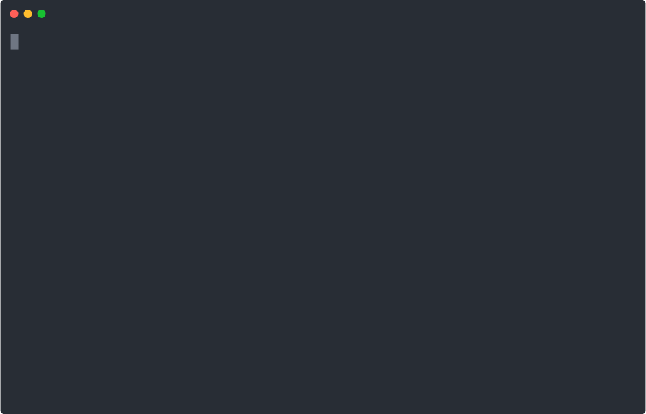

# 快速开始

此篇文档介绍插件开发的整套流程，开发前，请确保你的电脑已经安装了 [Node.js](https://nodejs.org/en/)。
## 开发

命令行工具可以帮助你调试，当拓展开发完成后，你也需要用它上传开发好的拓展信息到拓展市场。

安装命令行工具
```bash
$ npm i -g @eoapi/cli
```

现在你可以在全局范围内使用 `eo` 命令了。

### 创建拓展模板

现在可以创建一个最简单的模板，它会包含最基本的构建配置，如有需要你可以修改配置、甚至完全使用自己的配置。

> 目前仅支持创建 feature 类型的拓展



### 文件介绍

```js
// src/index.js
export const start = () => {
  return {};
};
```

最终会构建出一个 `umd` 规范的 JS 包，它至少导出一个主函数。

请注意：函数的名称（在本例中是`start`）需要与 `package.json` 中的 `features.apimanager.export.action` 字段的值保持一致：

```json
// package.json
{
  "features": {
    "apimanager.export": {
      "action": "start"
    }
  }
}
```

### 配置介绍

关于拓展暴露出来的所有配置项，都在 `package.json` 文件中，除了 `npm schema` 本身的规范字段外，与`eoapi`拓展相关的主要有以下字段，这里以导出类型的拓展为例：

```json
{
  "version": "{npm包的版本号，同时也作为拓展的版本号}",
  "description": "{拓展的描述}",
  "main": "{入口文件}",
  "module": "{入口文件}",
  "moduleID": "{拓展ID}",
  "moduleName": "{显示在拓展时长的名称}",
  "moduleType": "{拓展类型：feature}",
  "logo": "{显示在拓展市场的Logo}",
  // 在keywords中填写关键字段，利于在拓展市场中搜索
  "keywords": [],
  "author": "{作者}",
  "features": {
    "apimanager.export": {
      "action": "{导出的主函数名}",
      "label": "{用户在功能区域看的标识}"
      // ... 其他个性化配置项
    }
  }
}
```

系统在运行拓展时，会获取 `feature.apimanager.export` 下的 `action` 得到函数名。进而从拓展的包内容中导入该函数并执行。

## 调试

当我们开发了一个叫 `foo` 的拓展后，需要将它映射到本地，并让 Eoapi 能够识别它。我们已经帮你做了一些工作，你只需要运行以下命令，即等效于正式安装了拓展在本地。

```
$ eo debug foo
```

:::warning
目前部分拓展需要重启 Eoapi 后才能看到更新，我们正在尽快开发体验良好的热更新功能。
:::

## 上传

开发完成并构建后，通过以下命令将拓展上传到官方的拓展市场。别忘了将拓展发布到`npm`平台，因为目前拓展是以 `npm` 的形式安装的。

```bash
$ eo upload foo
```
