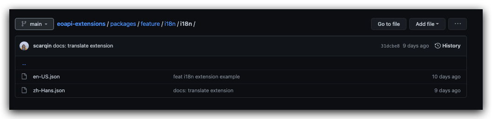

# 多语言

可以在不同的语言环境下显示不同的插件包

## 示例代码

[i18n](https://github.com/eolinker/eoapi-extensions/tree/main/packages/feature/i18n)

## 配置

### package.json

在 package.json 配置 `i18n` 字段

```json
// package.json
{
  "name": "eoapi-i18n",
  "version": "1.0.0",
  "description": "The i18n example extension of eoapi",
  "author": "scar",
  "main": "dist/index.js",
  "logo": "http://dummyimage.com/125x125",
  "scripts": {
    "build": "rollup -c rollup.config.js",
    "build:watch": "rollup -w -c rollup.config.js"
  },
  "devDependencies": {
    "rollup": "^2.70.2"
  },
  "features": {
    "exportAPI": {
      "action": "exportFunc",
      "label": "${function.label}", //在 feature 中通过 ${i18n name} 使用
      "description": "${function.description}",
      "icon": "http://dummyimage.com/125x125",
      "filename": "data.json"
    },
    //i18n 配置
    "i18n": {
      "sourceLocale": "en-US", //默认语言，使用 eoapi 规定的 localeID
      "locales": [
        "zh-Hans" //支持语言
      ]
    }
  }
}
```

### 配置语言包

插件根目录下新建名为 `i18n` 的文件夹，语言包名称为 [LocaleID](/api/feature-contribution/i18n.html#localeid-表)


```json
//en-US.json
{
  "description": "The i18n example extension of eoapi", //如果语言包 json 里面找不到，会使用 package.json 的文件
  "logo": "http://dummyimage.com/125x125",
  "function.label": "en Data(.json)",
  "function.description": "export api data",
  "now-lanuage": "Now lanuage is: {0}"
}
```

```json
//zh-Hans.json
{
  "description": "国际化插件示例",
  "author": "秦一",
  "logo": "http://dummyimage.com/200x100",
  "function.description": "导出 API 数据",
  "function.label": "zh Data(.json)",
  "now-lanuage": "当前语言是：{0}",
  "multiple-variable": "替换多个变量： {0} {1}"
}
```

<!-- ### 在 Javascript 中使用

通过 eo.i18n 函数

```Typescript
eo.i18n.localize:(originText:string,replacement:string,...variable)=>string;

export const exportFunc = (data = {}) => {
  console.log(eo.i18n.localize("export-id", "I am origin text"));
  //localize(id:string,originText:string,...args)
  console.log(
    eo.i18n.localize(
      "now-lanuage",
      "Now lanuage is: {0}",
      eo.i18n.getSystemLanguage()
    )
  );

  //id can be ignore in default localize i18n json
  console.log(
    eo.i18n.localize(
      "multiple-variable",
      "Replace multiple variable: {0} {1}",
      0,
      "1"
    )
  );
  return {
    name: "eoapi",
  };
};
``` -->

## LocaleID 表

| 语言      | ID      |
| --------- | ------- |
| 中文-简体 | zh-Hans |
| 中文-繁体 | zh-Hant |
| 英语-美国 | en-US   |
| 法语      | fr-FR   |
| 日本      | ja-JP   |
| 俄罗斯    | ru-RU   |
