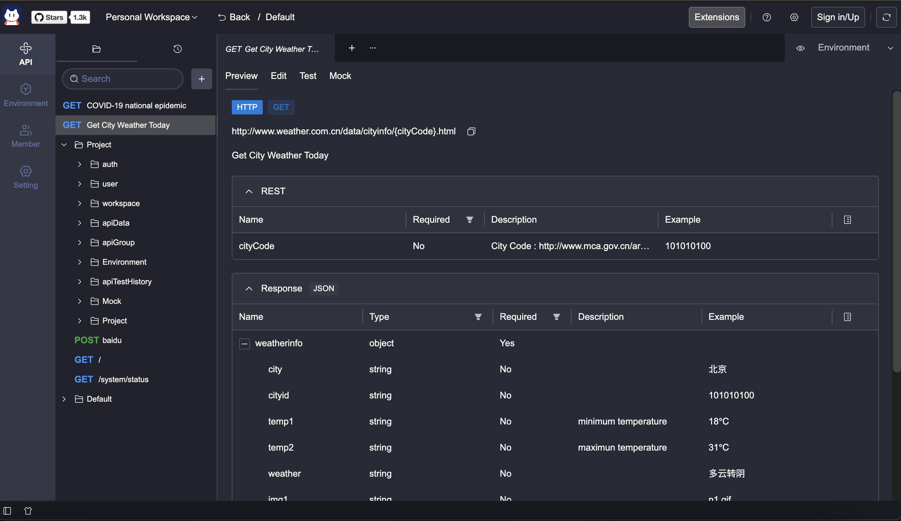
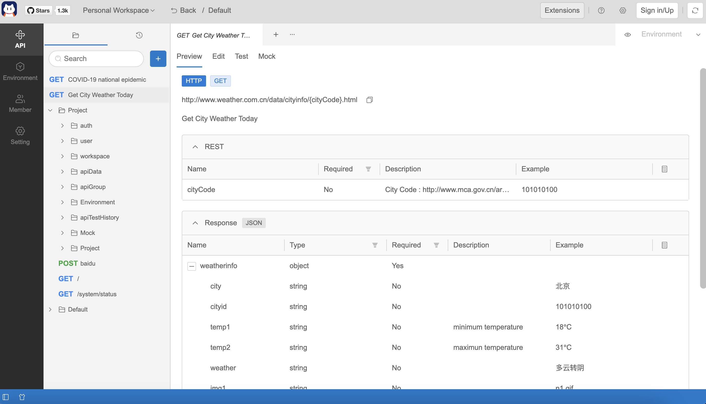
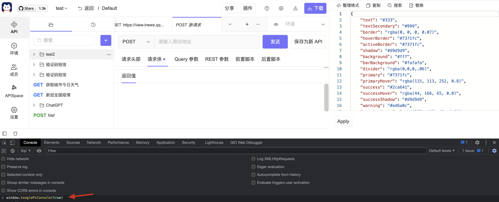

# 主题

主题插件允许我们自定义应用各模块颜色，使用自己喜欢的颜色配置 Postcat ～





## 示例代码

自定义主题：[vscode postcat dracula](https://github.com/Postcatlab/postcat-extensions/tree/main/packages/vscode-postcat-dracula)

## 配置

```json
//package.json
{
  "name": "vscode-postcat-dracula",
  "title": "Dracula Official Theme",
  "version": "0.0.5",
  "description": "VSCode Dracula Official theme",
  "author": {
    "name": "Postcat"
  },
  "engines": {
    "postcat": "^0.0.1"
  },
  "logo": "https://data.eolink.com/Q3KxMRJdf30c17f31607f0618109545612af625f5146a7d",
  "categories": ["Themes"],
  "features": {
    "theme": [
      {
        "label": "${theme.label}",
        "baseTheme": "pc-dark", //pc | pc-dark
        "id": "vscode-dracula",
        "path": "./themes/default.json"
      }
    ],
    "i18n": {
      "sourceLocale": "en-US",
      "locales": ["zh-Hans"]
    }
  }
}
```

JSON 颜色配置示例：

```json
// default.json
{
  "colors": {
    "icon": "#c5c5c5",
    "text": "#f8f8f2",
    "background": "#282a36",
    "primary": "#44475a",
    "info": "#3794ff",
    "divider": "rgba(248, 248, 242, 0.2)",
    "textLink": "#3794ff",
    "danger": "#ff5555",
    "barBackground": "#191a21",
    "border": "transparent",
    "tabsBadge": "#6272a4",
    "tabsActiveBadge": "#f8f8f2",
    "inputIcon": "#f8f8f2",
    "inputBorder": "rgba(248, 248, 242, 0.2)",
    "selectBorder": "rgba(248, 248, 242, 0.2)",
    "inputPlaceholder": "#6272a4",
    "selectItemSelectedText": "#f8f8f2",
    "selectItemSelectedBackground": "#44475a",
    "layoutHeaderBackground": "rgb(33, 34, 44)",
    "layoutSidebarBackground": "rgb(52, 55, 70)",
    "layoutSidebarText": "#6272a4",
    "menuItemActiveText": "#f8f8f2",
    "layoutFooterBackground": "rgb(25, 26, 33)",
    "layoutFooterText": "rgb(248, 248, 242)",
    "treeBackground": "rgb(33, 34, 44)",
    "buttonPrimaryText": "#f8f8f2",
    "buttonBorder": "transparent",
    "buttonDefaultBorder": "rgba(248, 248, 242, 0.2)",
    "buttonDefaultHoverBackground": "#52556c",
    "buttonDefaultHoverText": "#f8f8f2",
    "tabsCardText": "#6272a4",
    "tabsCardItemActiveText": "#f8f8f2",
    "tabsCardItemBackground": "#21222c",
    "tabsCardItemActiveBackground": "#282a36",
    "tabsCardItemActive": "transparent",
    "activeBorder": "#6272a4",
    "radioBorder": "#6272a4",
    "radioCheckedBackground": "#6272a4",
    "checkboxInner": "#f8f8f2",
    "checkboxBorder": "#191a21",
    "checkboxCheckedBackground": "#21222c",
    "checkboxCheckedBorder": "#191a21",
    "collapseBorder": "rgba(248, 248, 242, 0.2)",
    "collapseHeaderBackground": "rgba(248, 248, 242, 0.04)",
    "tableBorder": "rgba(248, 248, 242, 0.2)",
    "tableHeaderBackground": "rgba(248, 248, 242, 0.04)",
    "tableHeaderText": "rgb(248, 248, 242)",
    "scrollbarThumbBackground": "rgba(121, 121, 121, 0.4)",
    "dropdownBackground": "#343746",
    "dropdownItemHoverBackground": "#44475a",
    "dropdownItemHoverText": "#f8f8f2",
    "spin": "#a4aad0"
  }
}
```

所有颜色配置可见：[theme.model.ts](https://github.com/Postcatlab/postcat/blob/main/src/workbench/browser/src/app/core/services/theme/theme.model.ts)

## 快速调试

可以通过打开控制台，配置颜色看效果，配置结束后再上传插件。


