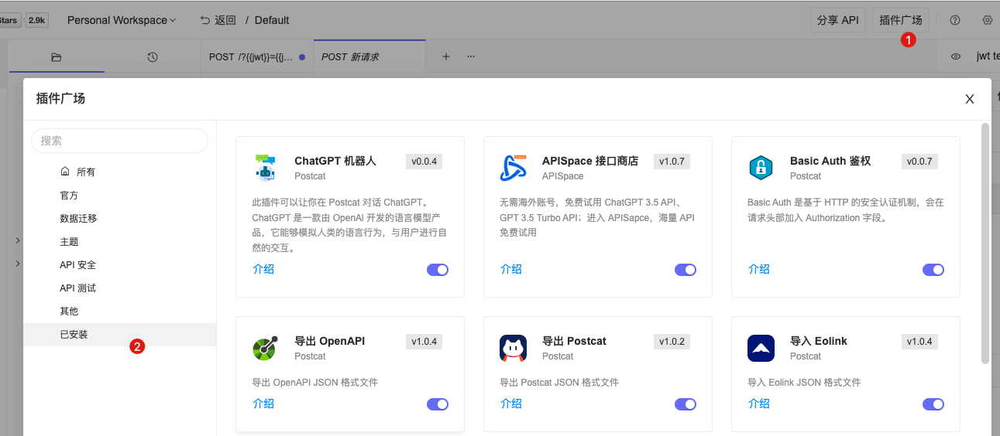

# 快速开始

此篇文档介绍插件开发的流程，开发前，请确保你的电脑已经安装了 [Node.js](https://nodejs.org/en/)。

插件由两部分代码组成：

- 入口文件 `package.json`
- 功能代码

## 开发

命令行工具可以帮助你快速生成插件代码模板、一键调试，以及上传插件到插件广场。

安装命令行工具

```bash
$ npm i -g @postcat/cli
```

现在你可以在全局范围内使用 `pcex` 命令了。

### 创建插件模板

现在可以创建一个最简单的模板，它会包含最基本的构建配置，如有需要你可以修改配置、甚至完全使用自己的配置。

```bash
$ pcex g foo
# or
$ pcex generate foo
```


它会在当前目录创造一个插件工程文件夹 `foo`，里面有插件的示例代码。

进入文件夹，安装依赖后即可开始开发。

```
$ cd foo
$ npm i
```

### 入口文件

Postcat 应用需要通过入口文件 `package.json` 找到插件，了解插件的信息，例如名称、版本号、拓展哪部分功能。

除了 [npm schema](https://docs.npmjs.com/cli/v8/configuring-npm/package-json) 本身的规范字段外，与 `postcat` 插件相关的主要有以下字段：

```json
{
  "name": "插件唯一字符串 ID，例如:postcat-import-openapi",
  "version": "三位字符版本号",
  "main": "Browser/Node 入口文件",
  "description": "插件描述",
  "homepage": "首页地址",
  "author": "作者名称",
  //插件类别
  "categories": ["Data Migration", "Themes", "API Testing", "Other", "API Security"],
  //postcat 拓展专属字段
  "title": "插件标题",
  "logo": "插件 Logo，在线地址/本地地址",
  //插件所扩展的功能
  "features": {
    "sidebarView": {},
    "importAPI": {},
    "exportAPI": {},
    "i18n": {},
    "configuration": {}
  }
}
```

### 功能代码

它至少导出一个函数（命名导出），以导出 OpenAPI 格式的插件为例，入参一般是应用提供的数据例如 API 信息，导出转换后的内容。

```js
// src/index.js
export const exportOpenAPI = (apiInfo) => {
  return transformPostcatToOpenAPI(apiInfo); // 将 Postcat 格式的数据转换成 OpenAPI 格式的数据
};
```

:::warning
导出函数的名称（在本例中是`exportOpenAPI`）需要与 `package.json` 中的 `features.exportAPI.action` 字段的值保持一致。
:::

```json
// package.json
{
  "features": {
    "exportAPI": {
      "action": "exportOpenAPI"
    }
  }
}
```

## 调试

当我们开发了一个叫 `foo` 的插件后，需要将它映射到本地，并让 Postcat 能够识别它。我们已经帮你做了一些工作，你只需要运行以下命令，即等效于正式安装了插件在本地。

如果是 Typescript 开发的插件，`debug` 前请进行构建。

```bash
$ pcex debug foo
```

:::warning
目前部分插件需要重启 Postcat 后才能看到更新，我们正在开发体验良好的热更新功能。
:::

重启后可以在已安装列表看到插件。


## 打包

最终会构建出一个 `umd` 规范的 JS 包，

## 上传

1. 请将插件发布到`npm`平台，因为目前插件是以 `npm` 的形式安装的，具体文档可以参考：[创建并发布一个 npm 包
   ](https://juejin.cn/post/6987695534504935438)
2. 开发完成并构建后，通过以下命令将插件上传到官方的插件广场。

```bash
$ pcex upload foo
```

经过官方审核后，才能在真正在插件广场中看到，整个过程通常需要一天的时间。
