# 模块开发指南

EOAPI-Core支持自定义模块来扩展功能，支持自定义命令行模块和API模块，模块的加载以hook机制实现。

## 模块参数说明

### 命令行扩展

命令行的扩展方式是定义core__开头的函数，终端会自动加载并运行。

### API的Hook扩展

API的hook扩展方式是定义app__{hook_name}组合的函数，那么在{hook_name}在被调用时会自动运行该函数。

### EO对象属性

- logger 日志记录
- module 模块管理
- hook   hook扩展
- command 命令行对象
- input 调用其他模块输出的源数据
- output 其他模块调用处理后的返回数据

## 核心模块

核心模块是指EOAPI-Core启动时自带的模块。

### 核心模块开发

1 创建文件

* 在src/modules目录下创建模块文件夹，并创建index.ts文件。如"src/modules/demo/index.ts"

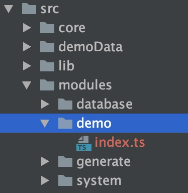

2 模块实现

```typescript
import { EOInterface, EOModuleInterface } from '../../types';

const module = (): EOModuleInterface => {
  return {
    id: 'demo', // 模块标识
    name: 'Demo', // 模块名称
    core: '1.x', // 模块所属核心版本
    version: '1.0.0', // 模块版本
    description: 'Demo module of eo', // 模块简介
    package: 'Core', // 模块分类
    // 扩展命令行
    cli__core(eo: EOInterface) {
      eo.logger.info(`run cli__core [${this.name} ${this.version}]`);
      eo.command
        .command('demo')
        .alias('d')
        .argument('<hook>', 'hook name')
        .description('display hooks description.')
        .action((hook: string) => {
          eo.logger.info(`help of hook name ${hook}`);
          if ('db_load' === hook) {
            eo.logger.info('api扩展hook <db_load>测试');
            eo.hookDemo();
          }
        });
      return eo;
    },
    // 实现指定的hook name "db_load"
    app__db_load(eo: EOInterface) {
      console.log('app__db_load');
      // 可将处理后的数据扔回eo.output对象
      eo.output.push('demo测试数据');
      return eo;
    }
  };
};

export default module;
```

3 启用模块

**引入**

在文件src/lib/mobules.ts中引入模块demo

```typescript
import demoModule from '../modules/demo';
```

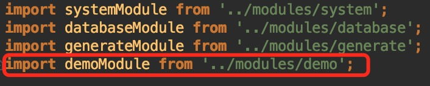

**启用**

在方法loadContributedModules加入引入的模块
```typescript
modules.push(demoModule());
```

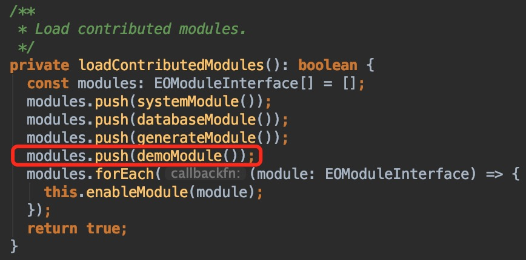


4 测试运行

**编译**

核心模块完成后，需要重新编译核心，运行
```bash
npm run build
```

**命令行演示**

```bash
./bin/eo demo abc
```

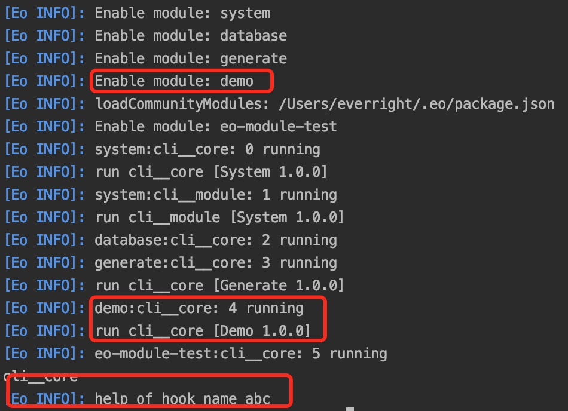

**API扩展演示**

```bash
./bin/eo demo db_load
```

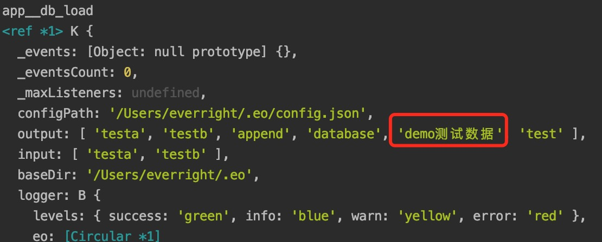

## 社区模块

社区模块是指第三方基于Hook机制开发的模块，通常以eo-module-开头，并提交到NPM可以由用户自行选择安装和加载。

### 模块创建

模块的初始化代码可以使用eo命令或从git仓库来生成。

#### eo命令创建

```typescript
// eo g module_name
eo g demo
```

命令执行后，会在当前目录生成eo-module-demo的文件夹。在指定模块名称时，如果不是以eo-module-开头，则会自动加上前缀。

#### Git仓库创建

```bash
git clone https://github.com/eolinker/eo-module-demo.git
cd eo-module-demo
npm init
```

#### 文件结构

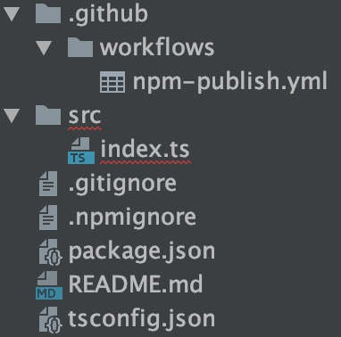

目录eo-module-demo创建后，进入目录，并执行依赖的安装。

```bash
cd eo-module-demo
npm init
```

### 模块开发

模块的代码位于src/index.ts

```typescript
module.exports = () => {
  return {
    id: 'eo-module-demo',
    name: 'EO Module Demo',
    core: '1.x',
    version: '1.0.0',
    description: 'Demo module of EOAPI-Core',
    package: 'Community',
    cli__core(eo: any) {
      eo.logger.info(`run cli__core [${this.name} ${this.version}]`);
      eo.command
        .command('demo')
        .alias('d')
        .argument('<hook>', 'hook name')
        .description('display hooks description.')
        .action((hook: string) => {
          eo.logger.info(`help of hook name ${hook}`);
        });
      return eo;
    },
    app__db_load(eo: any) {
      console.log('app__db_load');
      eo.output.push('test');
      return eo;
    }
  }
}
```

#### 命令行模块

要扩展命令行功能，创建以cli__开头的函数，并建立相应的逻辑即可。EO对象属性与系统模块描述的相同。

#### API模块

要扩展API模块功能，创建app__{hook_name}组合的函数，并建立相应的逻辑即可。EO对象属性与系统模块描述的相同。

#### 自定义Hook

每个模块代码内可以实现自定义的hook，这样其他模块可以基于自定义的hook来扩展功能。

### 模块测试

在完成模块代码的开发后，需要运行build生成文件。

```bash
npm run build
```

开发模式下可以使用npm-link方式，到用户主目录下~/.eo/下安装模块进行测试。

### 模块发布

模块完成后，需要发布到NPM上，这样用户就可以安装并使用模块了。

不管是手工还是自动发布，我们都需要一个npm的账号。

**提示**：

- 发布的包名不能和npm现有的包名重名
- 每次提交的版本号要比上一次的高

#### 注册npm账号

登录npm官网注册https://www.npmjs.com/signup，注意邮箱要验证，会发送验证链接到你的注册邮箱，没有验证的话是不能发布代码的。

#### 手工发布

提示：如果你以前使用过npm淘宝镜像的下载链接，需要将下载链接先设置回来。

```bash
npm config set registry http://registry.npmjs.org
``` 
登录你的账号
```bash
npm login
``` 
按照你注册的用户名、密码和邮箱配置好，只用配置一次即可。

账号配置好，这时候看一下package.json中author尽量与npm账户一致。
在根目录下配置账号信息，，我上传的时候发现有提示必须admin权限才能上传问题就是没在根目录下配置信息

检查是否登录成功
```bash
npm who am i
```

配置成功之后就可以发布了。

```typescript
npm publish
```

#### 自动发布

Github上支持npm publish的action，配置文件已经在模版代码里了，模版代码里的发布动作是创建release时会触发。

要做的就是将代码提交到github，再配置npm的访问token。

生成npm token

1 登录https://www.npmjs.com/，点击头像，弹出菜单，点击"Access Tokens"。

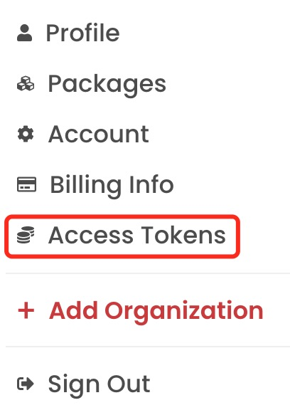

2 点击按扭 "Generate New Token"

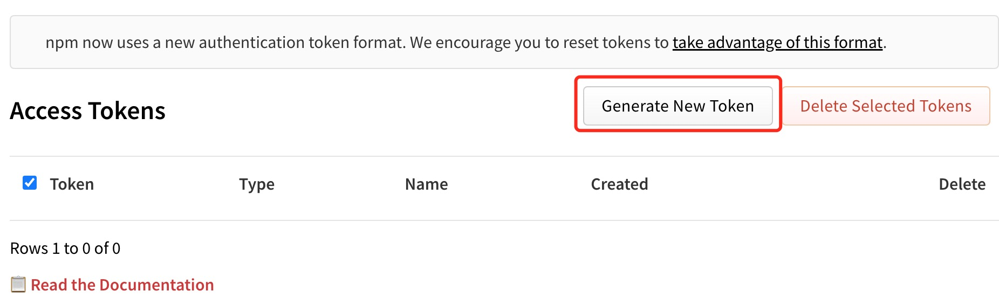

3 输出名称，Type选择Publish，最后点击按扭"Generate Token"生成Token。

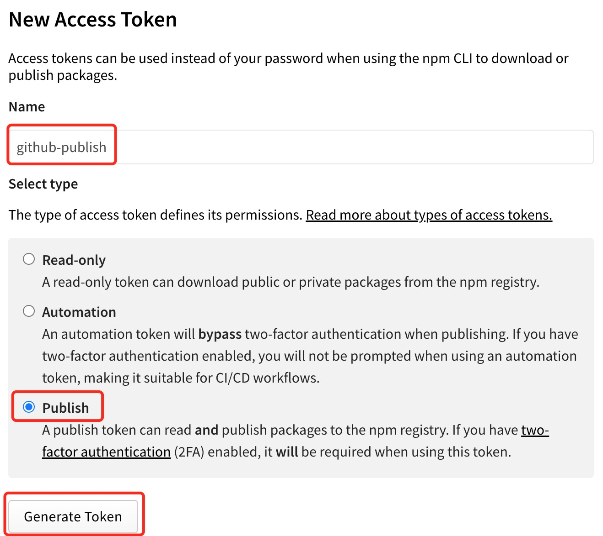

4 复制生成的Token，配置到Github。


Github配置

1 登录Github，并进入到对应的仓库。

2 点击"Settings"进入仓库设置，点击"Secrets -> Actions"，再点击按扭"New repository secret"。

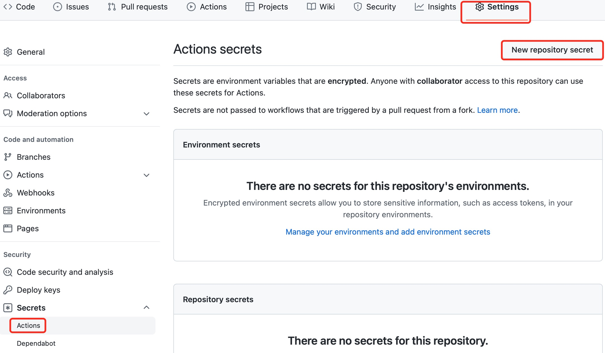

3 输出Name "npm_token"，Value 就是npm生成的token信息，点击按扭"Add secret"创建。

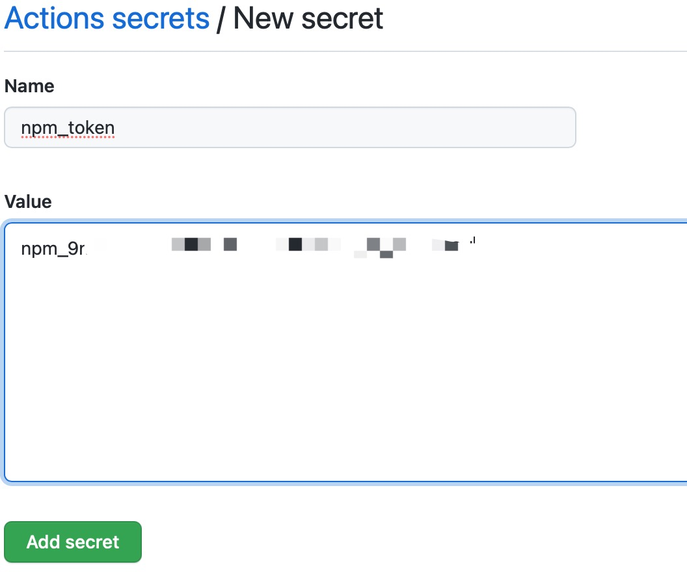

发布Release版本

上述配置成功后，那么在每次仓库发布Release时就会自动触发发布新版本到NPM了。
