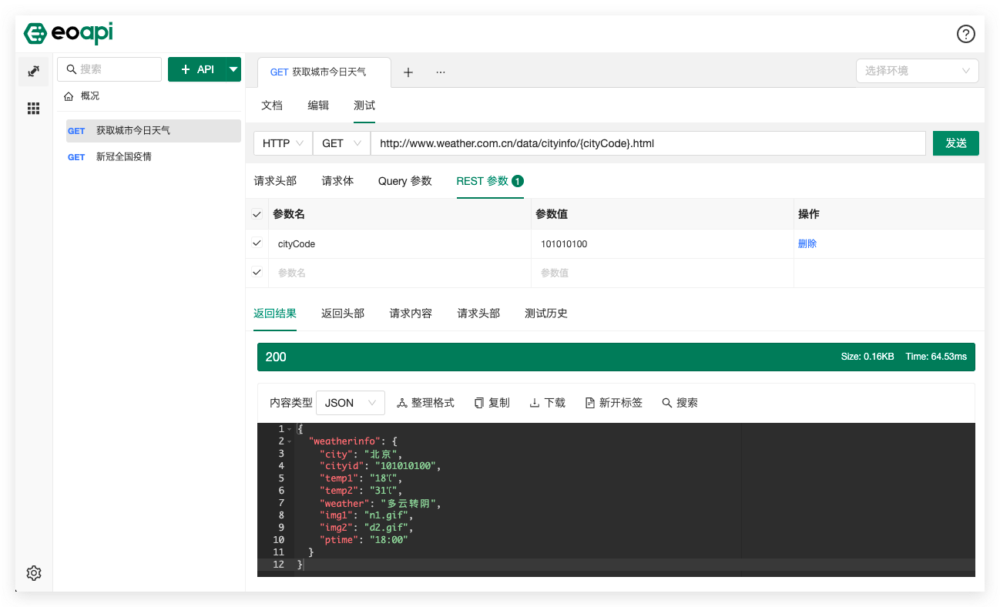

    

Eoapi 是一款开源 API 工具，它轻量，同时可拓展。

除了提供和 API 有关的核心功能，还可以通过插件市场帮助你将 API 发布到各个应用平台，比如发布到网关上完成 API 上线，或者和低代码平台结合，将 API 快速变成低代码平台中可使用的组件等。

- 你可以访问 [Live Demo](https://demo.eoapi.io/) 快速体验产品特性

- 访问 [Releases](https://github.com/eolinker/eoapi/releases) 下载 Windows、macOS 安装包。

Eoapi 全称是 Easy & Open API，我们希望通过工具让 API 管理更简单、更开放。

Eolink 在 2022 年开源了 Eoapi 项目，Eoapi 建立在 APIKit 多年以来在 API 全生命周期领域的行业经验基础之上，同时希望通过开源吸收社区中最棒的想法和实践。

## 我们为什么要做 Eoapi？

在社区中时常会出现“抱怨某商业产品越来越臃肿”的声音，API 工具也是如此。从最早期只做 API 调试的工具，到经过多年的演进后集成全面功能的“庞然大物”，它越来越成熟了，也越来越不适合最初的那批用户了。我们并不需要用到所有的功能，自然也会觉得自己用不上的功能是“多余”的。

我们希望个性和共性能够共存，因此，我们决定发布这款极其轻量的 API 工具，基础功能仅包括 API 文档和测试，满足开发者最核心的需求。同时：

**我们选择支持插件**：让每个功能满足所有人的需求是不可能的，通过不断地加功能满足需求只会让产品越做越重。插件系统则不一样，一个插件一个功能，你可以像组装乐高一样组装你想要的功能。

**我们选择拥抱开源**：我们希望将自己的技术沉淀、解决方案做成开源项目回馈给开源社区，也希望通过开源吸收社区中最棒的想法和实践，联合开发者、企业积极地共创插件生态。

## Eoapi 的核心价值

### 可拓展

Eoapi 支持插件系统，插件系统有两点好处：

- 可以只选择自己需要的功能，随时插拔
- 在遇到不满足现有需求的场景下，可以选择自己动手开发插件

在开源这款产品之前，我们在商业产品中沉淀了大量用户使用 API 管理工具的实践场景，所以官方也会在每年按照一定的频率发布官方插件，将商业产品上的沉淀贡献到开源。

同时我们将会配套相应的文档、插件示例以及提供一系列流畅的开发者体验脚手架，让大家可以快速的上手定制趁手的“兵器”。

<!-- ### 文档驱动开发 -->
