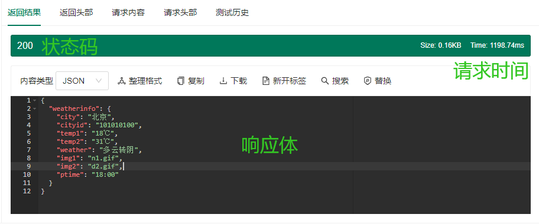
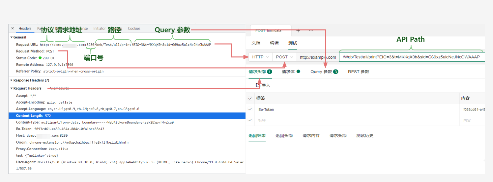

# 接口测试
接口开发完成后，我们需要调用接口来测试接口的表现，当表现符合预期时，则代表接口可用。

在测试中我们可能会关注**状态码、返回值以及响应时间**，这些数据 Eoapi 通通都会展示给你，判断 API 是否正常。

开始测试之前，我们需要先填写测试数据~，可以点击标签页的加号新建一个测试标签页。

还可以通过点击分组 API 的闪电图标快速对某个 API 发起测试。

我们常在浏览器看到的的 HTTP 格式对应在 EOAPI 的填写位置如图：

API Path/请求方式/请求头/Query 参数，请求地址里面可能包括了 Query 参数，URL 上填写的 Query 会同步更新在 Query 参数的表格里面。

<!--  -->
