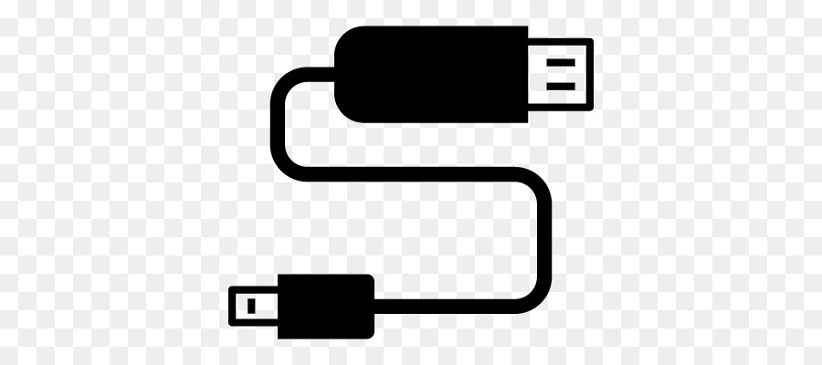

## API 是什么？

电脑主机、显示器、鼠标、键盘等设备之间通过数据线连接起来，数据线就是电脑和手机的接口。

 

API 则是软件之间或系统服务之间的桥梁，目前几乎所有的软件都通过 API 进行数据传输，我们通过 API 可以快速对外发布服务或者获取第三方服务，比如我们每天都会使用的短信验证码、人脸识别、在线支付、查询天气等，背后都是大量的第三方 API 为我们提供服务。

## 不同的请求体格式
### JSON
```json
{
  "string": "test",
  "array": [{ "dom1": {}, "dom2": false, "dom3": [] }],
  "object": { "dom1": "", "dom2": 0 },
  "null": null,
  "float": 11.11,
  "int": 1,
  "boolean": false
}
```
### Form-data
1. Form-data[content-type="multipart/form-data;"]

 

```Text
------WebKitFormBoundaryNWnXbkVpqUPjFVZq
Content-Disposition: form-data; name="multiple"

2
------WebKitFormBoundaryNWnXbkVpqUPjFVZq
Content-Disposition: form-data; name="formDataStructure"

formDataStructure
------WebKitFormBoundaryNWnXbkVpqUPjFVZq--
```

2. Form-data[content-type="application/x-www-form-urlencoded"]

 

```text
a=1&b=2
```
### XML
```xml
<?xml version="1.0" encoding="UTF-8" standalone="yes"?>
<root>
  <type version="1.0">projectMember</type>
  <statusCode version="webGlobalVal">000000</statusCode>
  <memberList>
    <memberNickName/>
    <inviteCall>2177295417@qq.com</inviteCall>
    <userNickName>[\u968f\u673a]\u65e0\u5d16\u5b50</userNickName>
    <userImage/>
  </memberList>
</root>
```
### Raw
```text
random text string
```