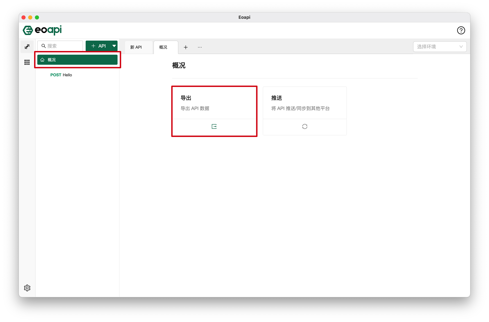
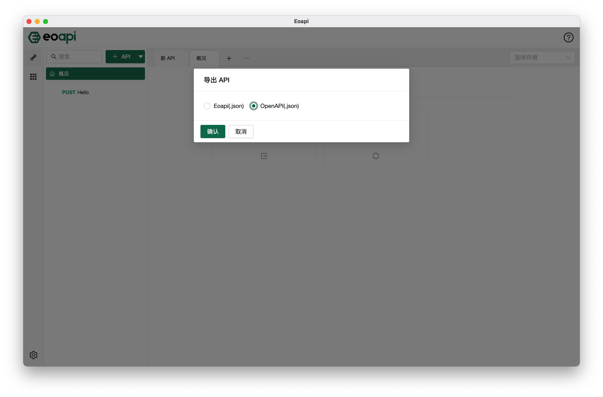
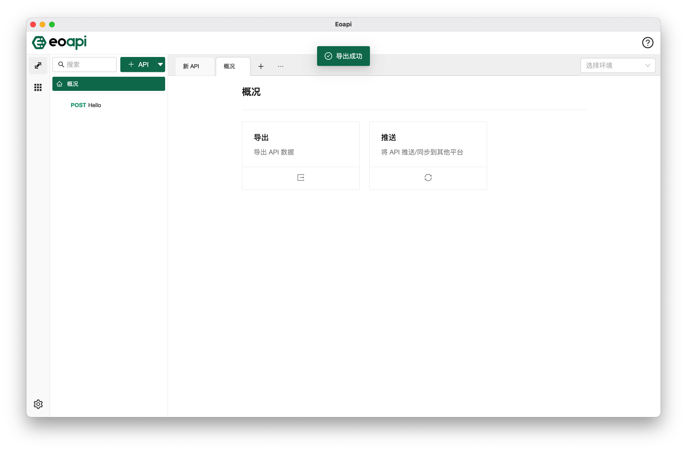

## 简介

可以使用导出类插件定期备份数据、与其他平台同步数据；
目前支持导出插件：

- Eoapi (.json)
- OpenAPI (.json)

### 使用

进入到主界面的概况页，可以看到导出功能，点击该区域打开相应弹窗，即可看到已安装的导出类插件的关键字，未安装时则不会显示。

请选择想要导出的文件格式，点击确定按钮即可完成导出。

### 导出结果

导出成功后可以看到提示成功的消息，表示导出过程无异常。如果导出异常，会弹出失败消息，请联系插件开发者协助排查。
