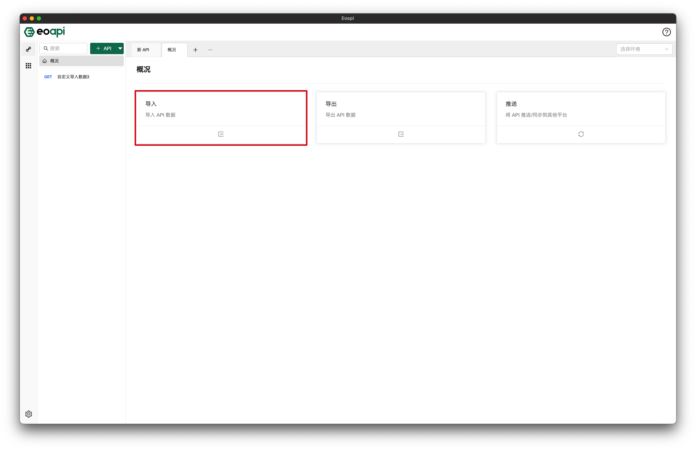
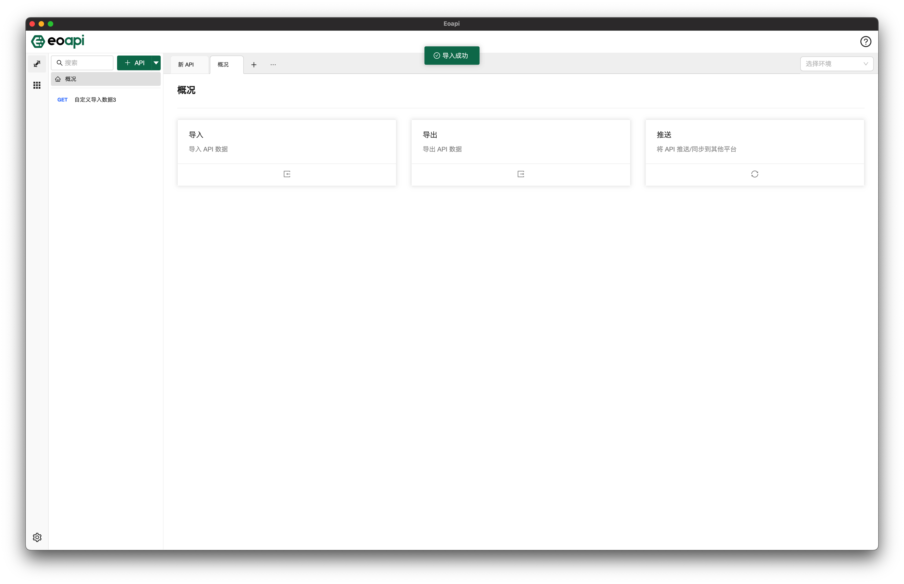

## 简介

导入功能用于将其他平台的 API 数据导入到 Eoapi, 以此完成数据迁移。

### 使用

进入到主界面的概况页，可以看到导入功能，点击该区域打开相应弹窗，即可看到已安装的导入类插件的选项，未安装时则不会显示。

请选择想要导入的源文件数据格式，并选择好导入的具体模式，各模式的区别取决于插件的设计和实现，不一定相同。最后将源文件拖入指定区域，点击确定按钮即可完成导入。

### 导入结果

导入成功后可以看到提示成功的消息，表示导入过程无异常。如果导出异常，会弹出失败消息，请联系插件开发者协助排查。
