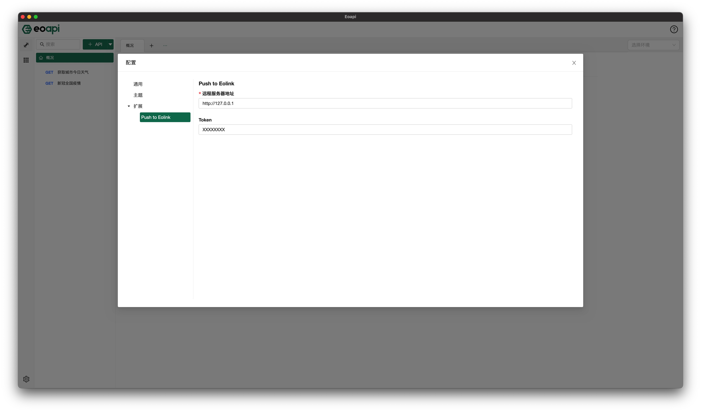
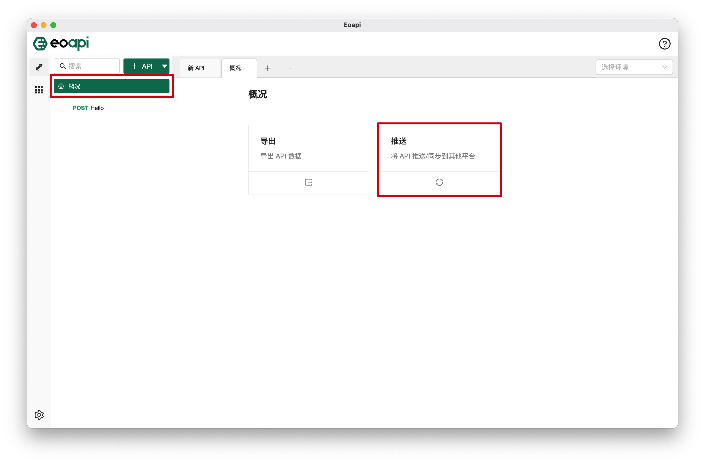
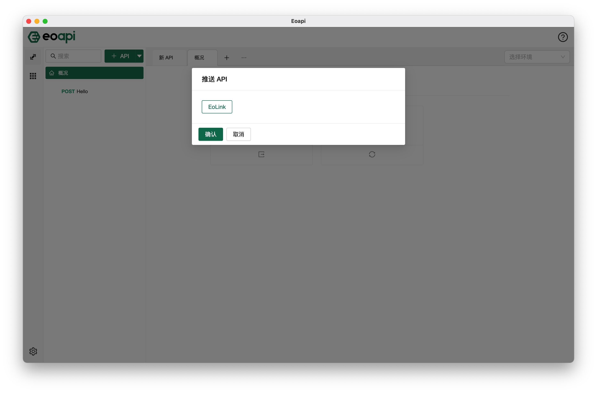

## 简介

推送类插件允许我们将 Eoapi 上的数据一键推送到各个应用平台，比如推送到网关上完成 API 上线，或者和低代码平台结合，将 API 快速变成低代码平台中可使用的组件等。

## Push to Eolink

将 Eoapi API 数据一键推送到 Eolink；

### 配置

此处以【**Push to Eolink**】插件为例，成功安装插件后，进入配置页面，配置令牌和远程地址。

### 使用

进入到主页面的概况页，可以看到推送功能，点击该区域打开相应弹窗，即可看到推送类插件的名称，未安装时则不会显示。请选择想要的推送平台，点击【确定】按钮即可完成推送。

### 推送结果

推送成功后可以看到提示成功到信息，表示推送过程无异常。如果推送失败，会弹出失败消息，有可能是网络错误，或推送的数据不合法，可以联系拓展开发者协助排查。
