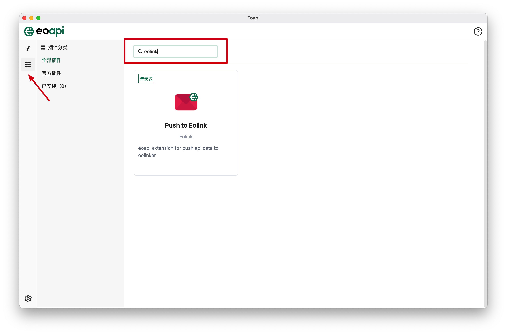
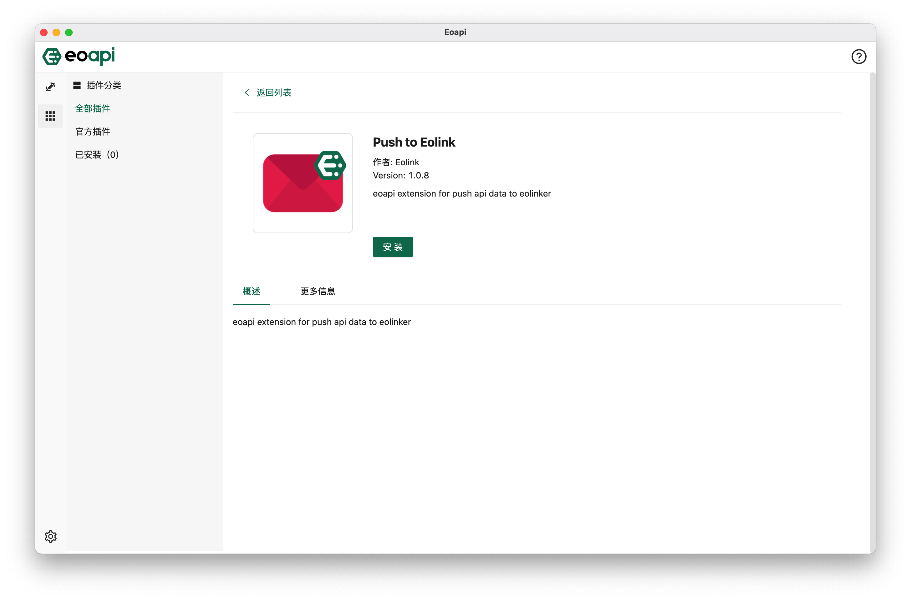
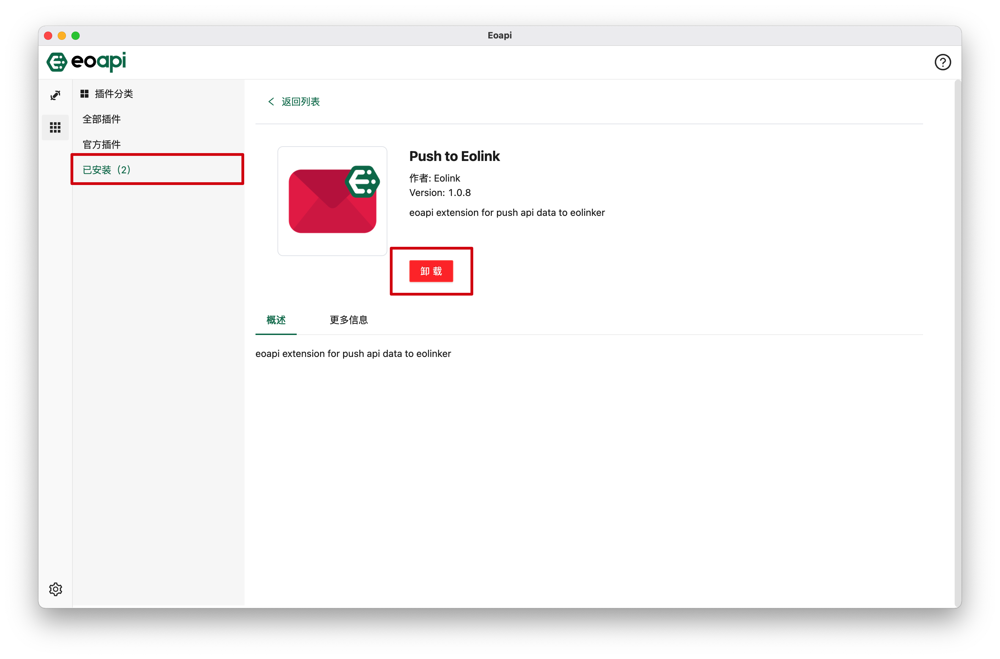

# 插件广场

插件机制是 Eoapi 的主打功能，意在让用户根据自身的痛点，自由拓展、订制自己需要的功能。不同的插件服务于不同的功能，很可能显示在不同的区域，也对应不同的 UI 和交互。

### 安装

启动 Eoapi 客户端后，点击相应图标进入插件广场页面，在插件列表中寻找或搜索想要的插件，可以看到插件卡片上会显示当前处于未安装或已安装的状态。

点击进入插件详情，点击【安装】按钮，稍后即可自动完成安装。

在详情页可以看插件展的详细信息，包括开发者、版本号和详细的功能介绍，点击【安装】按钮，即可完成安装。
### 配置

:::warning
尚未发布，努力开发中，敬请期待
:::

### 卸载

进入插件广场，切换到【已安装】的插件列表，选择想要卸载的插件，点击进入详情后，可以看到【卸载】按钮，点击后即可卸载。

> 卸载后将无法继续使用插件功能。