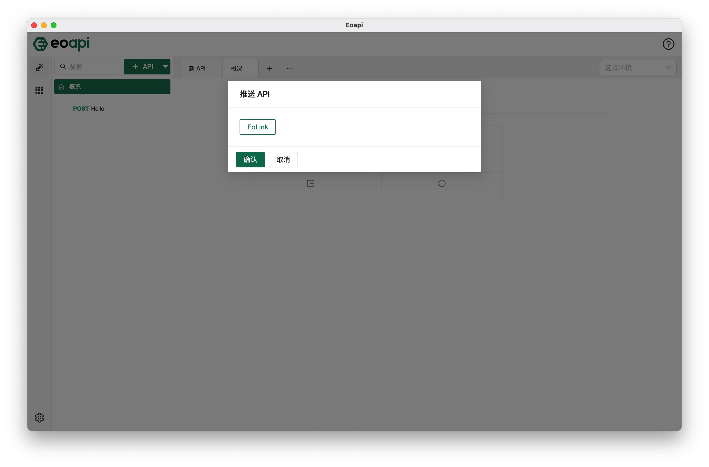
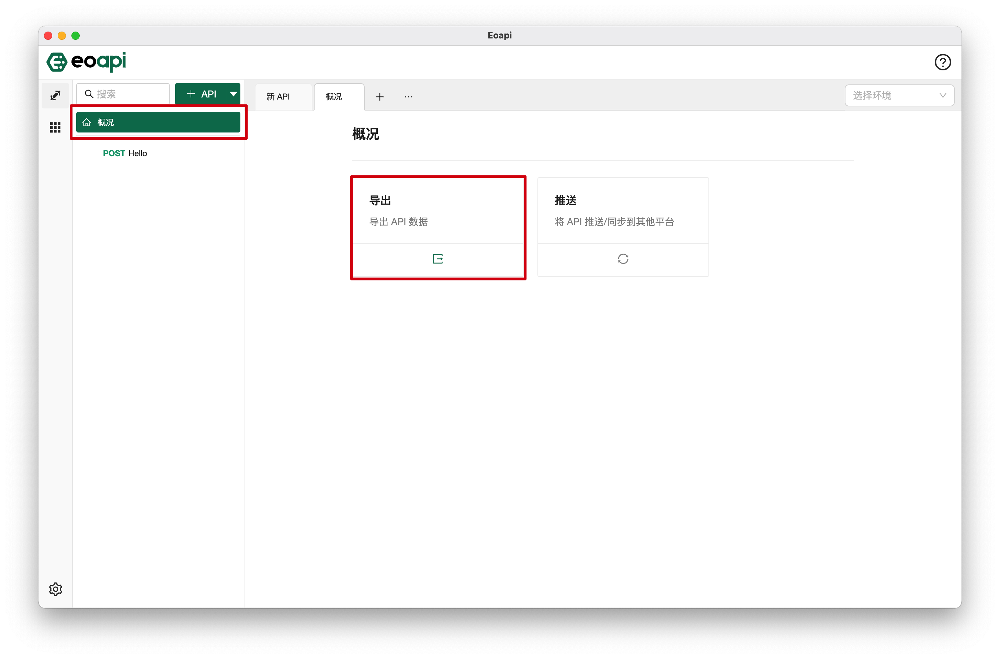
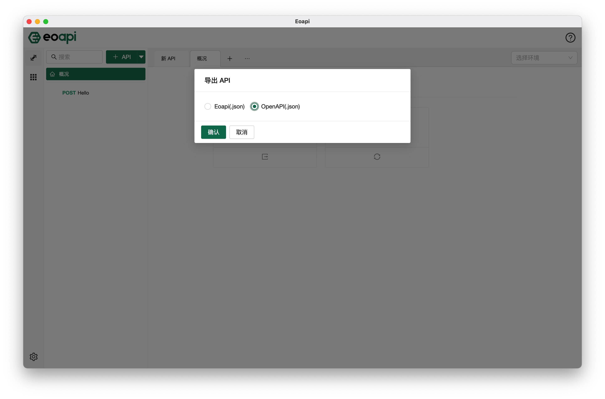

# 插件广场

## 简介

插件机制是EoApi的主打功能，意在让用户根据自身的痛点，自由拓展和订制自己需要的功能。不同的插件服务于不同的功能，很可能显示在不同的区域，也对应不同的UI和交互，需要根据插件的特点进行使用。

本文档仅展示较为基础的插件用法，部分插件可能需要用户自行配置令牌、私钥等重要字段。

### 安装

启动 EoApi 客户端后，点击相应图标进入插件市场页面，在插件列表中寻找或搜索想要的插件，可以看到插件卡片上会显示当前处于未安装或已安装的状态。

点击进入插件详情，点击【安装】按钮，稍后即可自动完成安装。

在详情页可以看到插件的详细信息，包括开发者、版本号和详细的功能介绍，点击【安装】按钮，稍后即可自动完成安装。

> 下次需要再使用同样的推送功能时，无需再重新安装插件。

### 配置

:::warning
尚未发布，努力开发中，敬请期待
:::

### 卸载

进入插件市场，切换到【已安装】的插件列表，选择想要卸载的插件，点击进入详情后，可以看到【卸载】按钮，点击后即可卸载。

> 卸载后将无法继续使用插件功能。

## 如何使用推送类插件

### 配置

此处以【**Push to Eolink**】插件为例，成功安装插件后，进入配置页面，配置令牌和远程地址。

> 配置界面待补充

### 使用

进入到主页面的概况页，可以看到推送功能，点击该区域打开相应弹窗，即可看到推送类插件的名称，未安装时则不会显示。请选择想要的推送平台，点击【确定】按钮即可完成推送。

### 推送结果

推送成功后可以看到提示成功到信息，表示推送过程无异常。如果推送失败，会弹出失败消息，有可能是网络错误，或推送的数据不合法，可以联系插件开发者协助排查。

## 如何使用导出类插件

### 使用

进入到主界面的概况页，可以看到导出功能，点击该区域打开相应弹窗，即可看到已安装的导出类插件的关键字，未安装时则不会显示。

请选择想要导出的文件格式，点击确定按钮即可完成导出。

### 导出结果

导出成功后可以看到提示成功的消息，表示导出过程无异常。如果导出异常，会弹出失败消息，请联系插件开发者协助排查。
