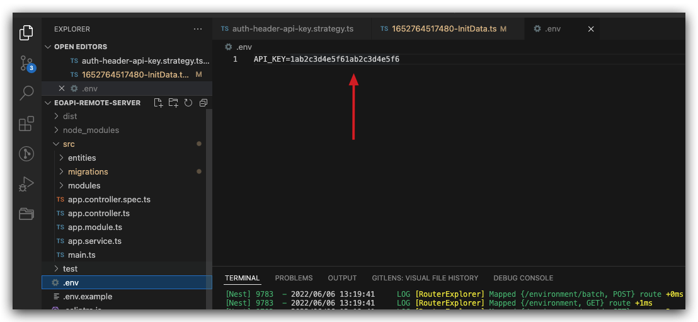
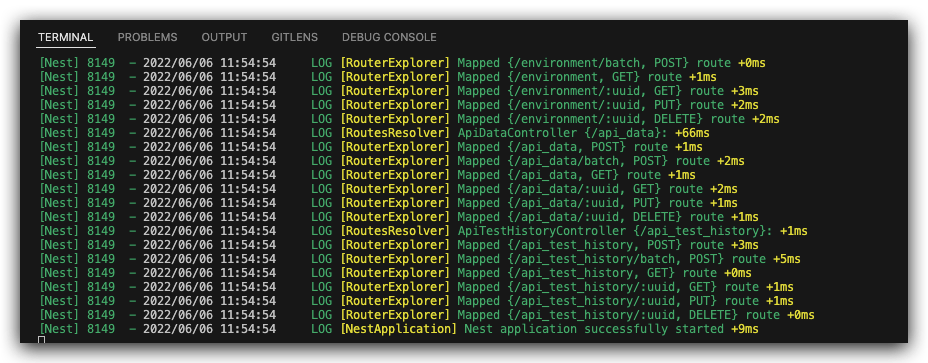

## 内网部署

Eoapi 提供两套数据源：

- 本地数据源：可单机/离线使用，IndexedDB 数据库
- 远程数据源：可远程协作，Node.js+MySQL

## 服务器部署

### 安装数据库

安装 [MySQL](https://zhuanlan.zhihu.com/p/27960044)
安装后开启 MySQL，创建一个名为 eoapi 的数据库。

```
mysql -u root -p
create DATABASE eoapi;
```

### 服务部署

1. 在服务器 Clone 仓库

```
git clone https://github.com/eolinker/eoapi-remote-server
```

2. 按照 README 部署好后，配置 ormconfig.json 文件
```
{
  "type": "mysql",
  "host": "localhost",
  "port": 3306,
  "username": "root",
  "password": "xxxxxx",//数据库密码
  "database": "eoapi",//数据库名称
  "synchronize": false,
  "logging": false,
  "entities": ["dist/entities/**/*.js"],
  "migrations": ["dist/migrations/**/*.js"],
  "migrationsRun": true,
  "cli": {
    "migrationsDir": "src/migrations"
  }
}
```
3. 配置 .env
访问远程服务需要加 token 鉴权，格式为 `API_KEY=xxx`
```
API_KEY=1ab2c3d4e5f61ab2c3d4e5f6
```


3. 启动服务
```
npm start
```
如图，项目启动成功


### 服务升级
如果数据库脚本有更新（添加字段、表），需要运行迁移脚本
```
npm run migration:run
```

文档可以看：https://typeorm.bootcss.com/migrations