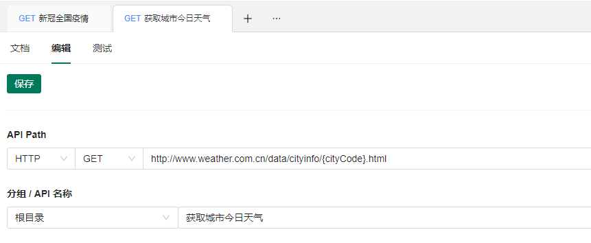
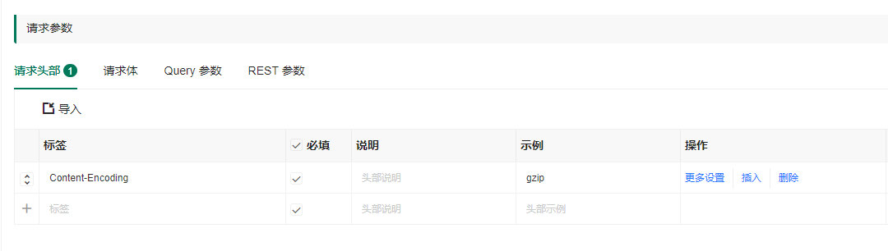
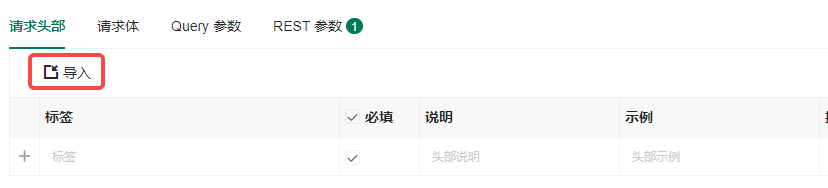
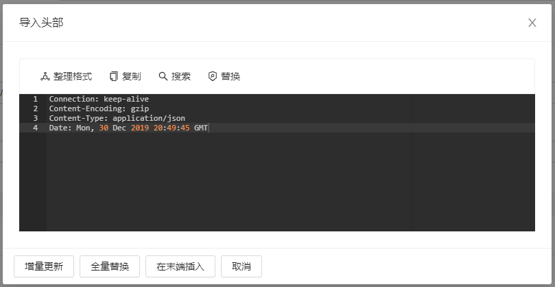
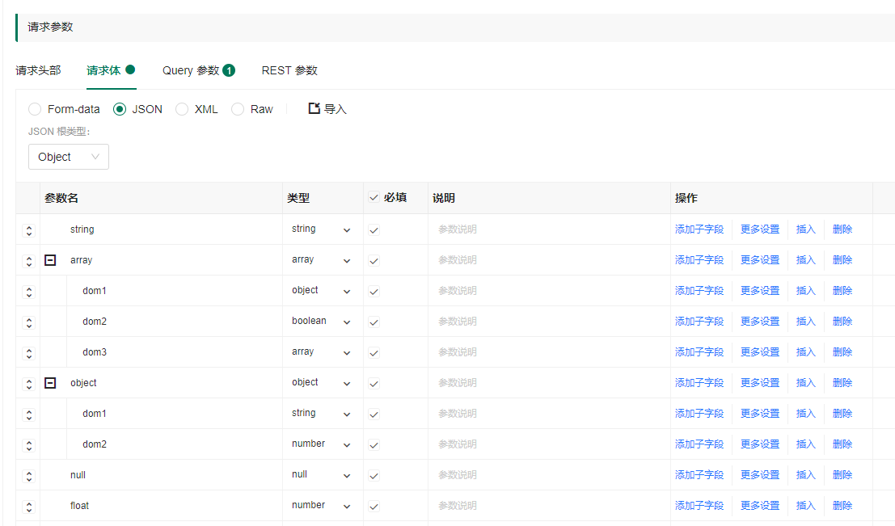
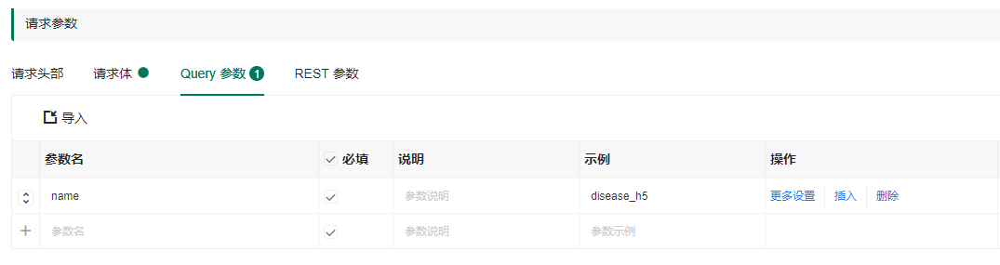
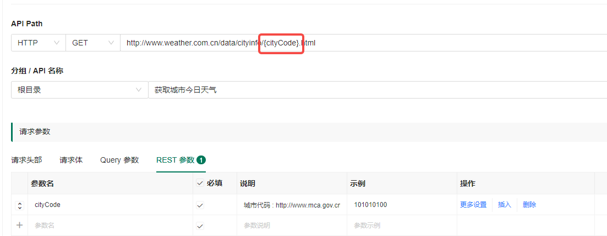
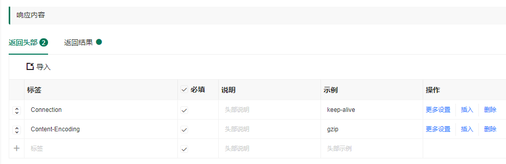
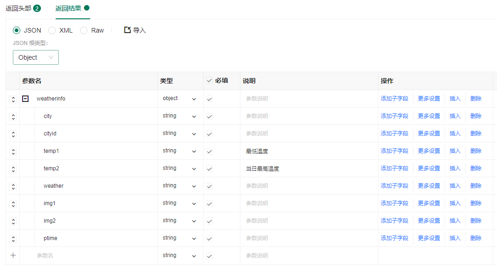

# 编辑 API

我们在开始一个新接口之前，需要进行以下判断：

- 请求协议是不是 HTTP/HTTPS？
- <a href="./concepts.html#json" target="_blank">请求体和响应体格式</a>是什么(XML、JSON、FormData、Raw)？
- API 是不是 RESTful 风格？

如果上面三个问题的答案都清楚了，就可以开始新增一个 API 接口。

## API 信息
在编辑 API 的顶部填写 API 的请求协议、方式、地址、名称；


### 协议支持

- HTTP/HTTPS

### 请求方式支持

- POST
- GET
- PUT
- DELETE
- HEAD
- OPTIONS
- PATCH

## API 请求参数

### 设置请求头部

你可以输入或导入请求头部。



除了手动输入，你还可以批量导入请求头部，数据格式为 **key : value** ，一行一条 header 信息，如：

```http
Connection: keep-alive
Content-Encoding: gzip
Content-Type: application/json
Date: Mon, 30 Dec 2019 20:49:45 GMT
```





### 设置请求体

请求体提供了五种类型：

1. Form-data（表单）
2. Json
3. XML
4. Raw（自定义文本类型数据）



### 设置 Query 参数

Query 参数指的是地址栏中跟在问号？后面的参数，如以下地址中的 user_name 参数：

```http
/user/login?user_name=jackliu
```

批量导入的数据格式为 **?key=value...** ，通过&分隔多个参数，如：

```
api.eolinker.com/user/login?user_name=jackliu&user_password=hello
```



### 设置 REST 参数

REST 参数指的是地址栏被斜杠/分隔的参数，如以下地址中的使用大括号包裹起来的 user_name、user_password 参数：

```
/user/login/{user_name}/{user_password}
```

:::warning
注意，你只需要在 URL 中使用 {} 将 REST 参数括起来，表单的参数名不需要填写 {}。
:::



## API 响应内容

### 设置响应头部

你可以输入或导入响应头部。批量导入的数据格式为 **key : value** ，一行一条 header 信息，如：

```
Connection: keep-alive
Content-Encoding: gzip
Content-Type: application/json
Date: Mon, 30 Dec 2019 20:49:45 GMT
```



### 设置响应内容

响应内容的编写方式和请求参数的类似，响应内容提供了四种类型：

1. Json
2. XML
3. Raw（自定义文本类型数据）


