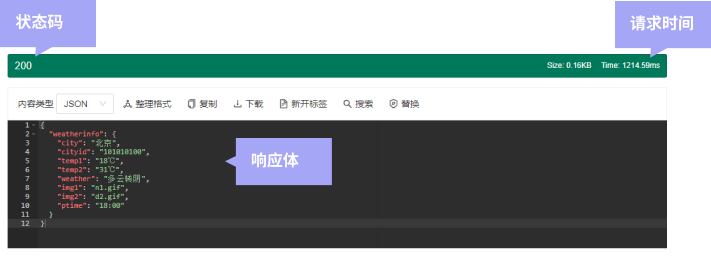
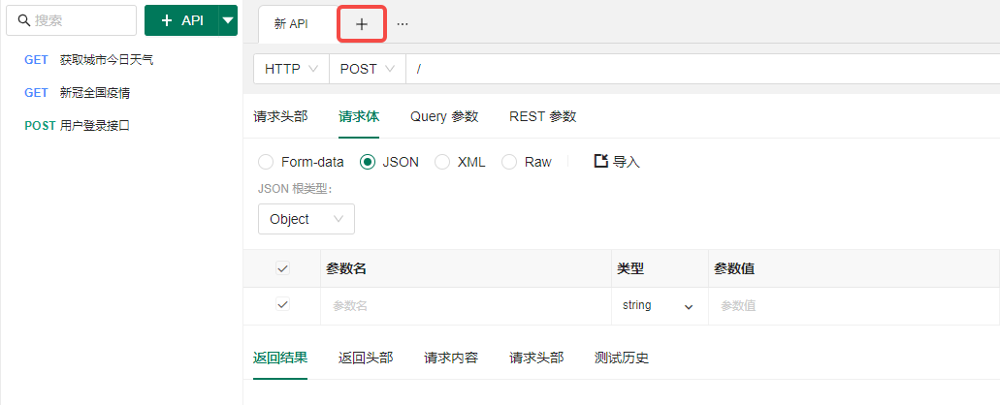
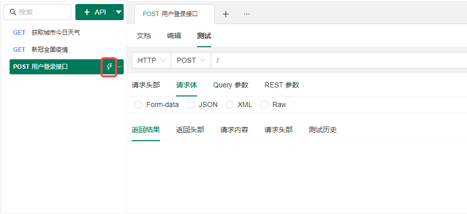
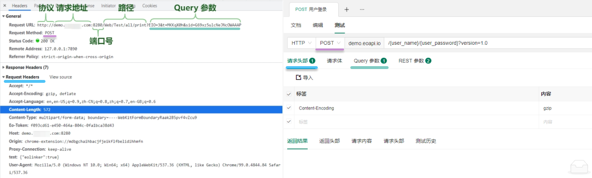
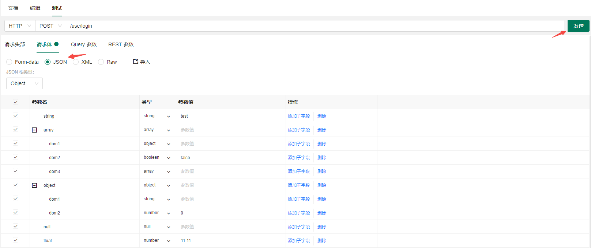
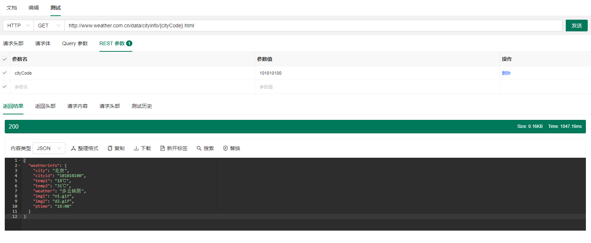
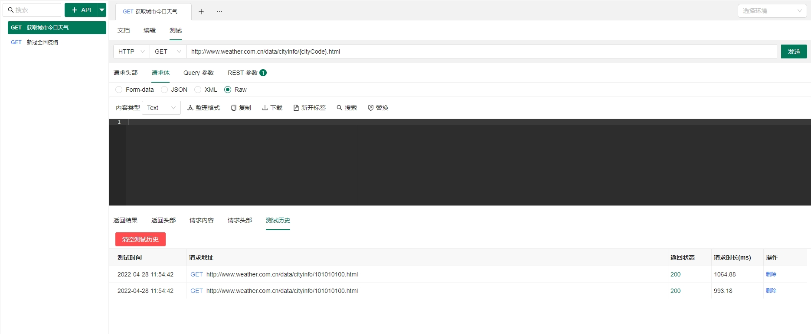
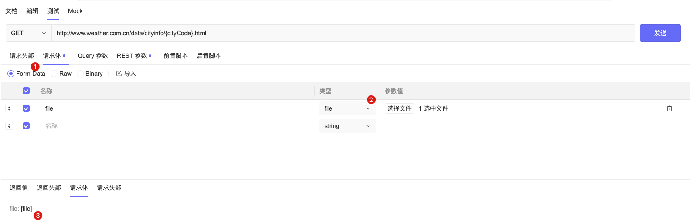

# 接口测试

接口开发完成后，我们需要调用接口来测试接口的表现，当表现符合预期时，则代表接口可用。

在测试中我们可能会关注**状态码、响应体以及响应时间**，这些数据 Postcat 通通都会展示给你，判断 API 是否正常。

开始测试之前，我们需要先填写测试数据~，可以点击标签页的加号新建一个测试标签页。

还可以通过点击分组 API 的闪电图标快速对某个 API 发起测试。

通过类比现有的知识去学习新的知识往往更快，平时我们一般会在浏览器里看 API 请求信息，这些信息在 Postcat 对应的位置是什么呢？相信通过下面的对照图你很快能知道如何在 Postcat 测试：

> 下划线颜色相同代表相同模块

请求 URL/请求方式/请求头/Query 参数

API Path 里面可能填写了 Query 参数，Postcat 会将它自动同步到 Query 参数的表格里面。

首先确认你的 <a href="./FAQ.html#json" target="_blank">HTTP 请求体格式</a>，选择相应的请求体格式后点击测试按钮。

就可以看到相应 API 响应信息啦！

通过点击测试历史，还可以回溯当时测试的所有 API 请求信息，快速回归测试。

## 文件测试

选中请求体为 Form-data，参数类型切换到 file，点击选择文件即可发起文件测试。

