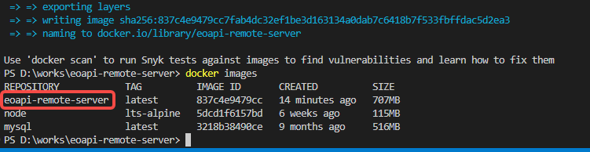

目前支持通过 Docker 安装部署应用，无需自己安装数据库 MySQL，一键即可部署成功。
## 服务部署
### 1. 安装 Docker

> Docker 版本需高于 v20.10

- Docker [安装指南](https://www.runoob.com/docker/macos-docker-install.html)
- 调试可以使用[桌面端下载](https://www.docker.com/products/docker-desktop/)

### 2. 克隆仓库

```
git clone https://github.com/eolinker/eoapi-remote-server
cd eoapi-remote-server
```

### 3. 环境变量配置

> _如果你没有配置数据库需求，可以[跳过此步骤](#_3-使用-docker-一键启动)，系统会使用默认配置启动_

在 `.env` 文件中统一配置 TOKEN 以及 MySQL 连接、端口等配置信息。

```bash
# auth token
API_KEY=1ab2c3d4e5f61ab2c3d4e5f6

# secret
JWT_SECRET=123456

# eoapi-server coinfigure
EOAPI_SERVER_PORT=3008
EOAPI_SERVER_PATH=/api

# mysql configure
TZ=Asia/Shanghai
# mysql的主机地址，如果连接的是docker容器内部的mysql，需要改为：host.docker.internal
MYSQL_HOST=localhost
# 映射到宿主机端口号
MYSQL_PORT=33066
MYSQL_USERNAME=root
MYSQL_DATABASE=eoapi
MYSQL_PASSWORD=123456a.
MYSQL_ROOT_PASSWORD=123456a.

# swagger
SWAGGER_PATH=swagger-docs
SWAGGER_ENABLE=true
SWAGGER_VERSION=1.0
SWAGGER_TITLE=Eoapi-remote-server API文档
SWAGGER_DESC=Eoapi remote server API document。
```

默认情况下，在 `src/config/ormconfig.ts` 和 `docker-compose.yaml` 文件中统一使用了 `.env` 配置里的环境变量，比如：服务端口号、MySQL 连接等信息。

### 4. 使用 Docker 一键启动

在项目代码根目录下，运行下面命令。

```bash
docker-compose up -d --build
```
启动成功后，可通过 `http://<server_url>:3000` 访问服务。

### 查看实时日志输出

如果需要查看运行日志，可以运行下面命令

```bash
docker-compose logs -f
```

### 离线部署

> 需要先在有网的环境生成镜像，并导入内网`docker`环境。

在项目根目录下执行以下步骤：
1. 构建镜像

```bash
docker compose build  
```

2. 查看镜像是否打包成功

```bash
docker images  
```




3. 导出制作好的镜像为本地文件  

语法格式： docker save {目标镜像} -o /{导出位置}/{导出镜像的名称}.tar

```bash
docker save eoapi-remote-server -o ./eoapi-remote-server.tar
```

4. 在内网环境中加载上面我们制作好的本地镜像

```bash
 docker load < ./eoapi-remote-server.tar 
``` 

5. 运行离线镜像

```bash
 docker run --name eoapi-remote-server -d -p 3000:3000 eoapi-remote-server
```

### 服务升级

:::warning
升级前做好数据库备份
:::

关闭服务后，运行迁移脚本，再重启服务即可。

```
npm run migration:run
```

## 客户端配置

点击设置，填入服务器地址、Token 后即可远程协作即可使用远程数据源。

