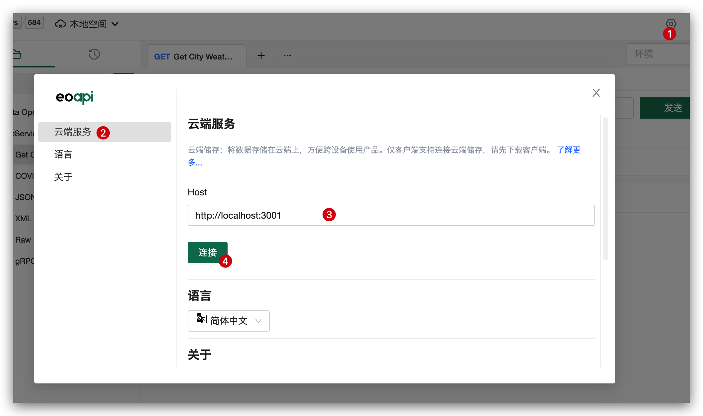
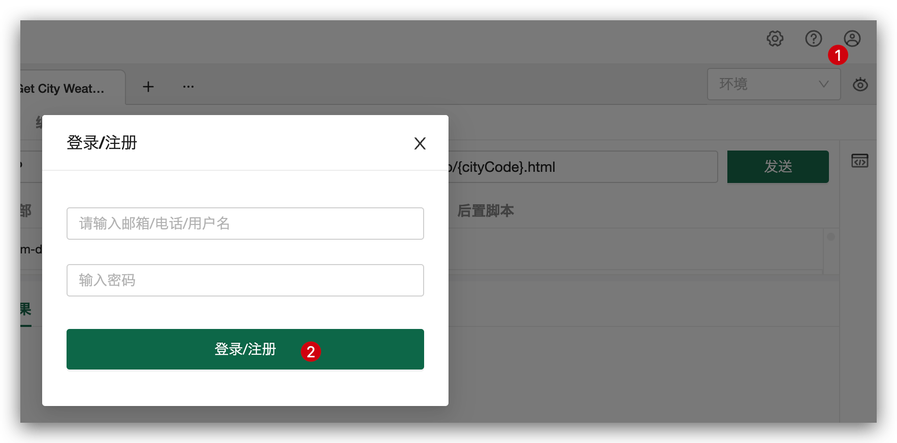
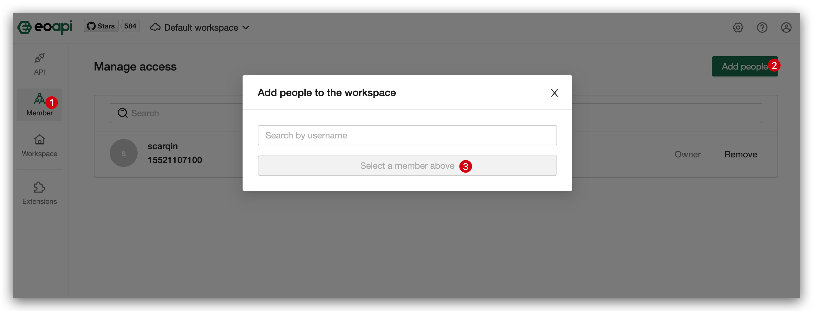

# 团队协作

> 自 v1.8.0 版本开始，我们支持通过部署云端服务进行团队协作。

如果你的团队目前并没有部署云端服务，请先部署[云端服务](/docs/storage)。

实现协作仅需要 4 步：

1. 配置 Eoapi
2. 注册账号
3. 创建空间
4. 添加成员
### 客户端配置
:::warning
如果你使用 web 打开 Eoapi，可以跳过此步骤
:::
在客户端点击设置弹框，填入部署好的服务器地址。

### 注册账号

输入账户/密码注册账号

注册成功后，你可以有两条路径：

- 如果你是团队负责人，你需要先[创建一个空间](#创建一个空间)
- 如果你要加入已有的空间，请让负责人通过[添加成员](#添加成员)将您加入空间
  :::info
  工作空间一般是一个团队，我们可以将团队里面的所有 API 文档都托管到空间中，方便大家贡献 API。
  :::

## 创建一个空间

点击导航栏上的空间列表，添加一个云端空间。

## 添加成员

添加成功后，就可以一起协作了～