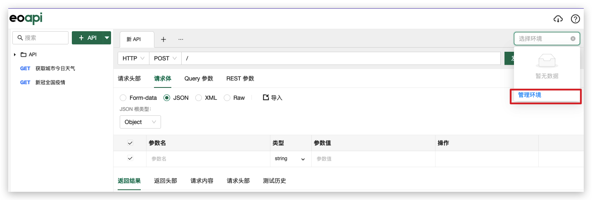
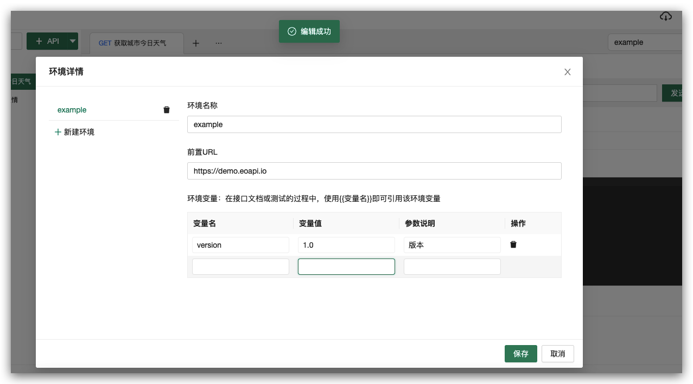
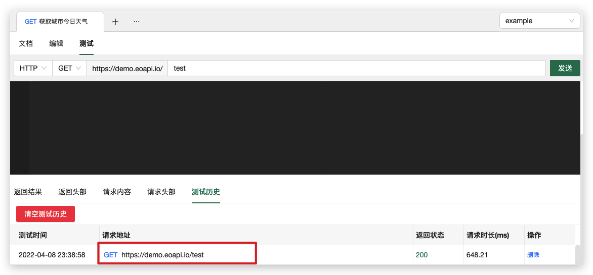
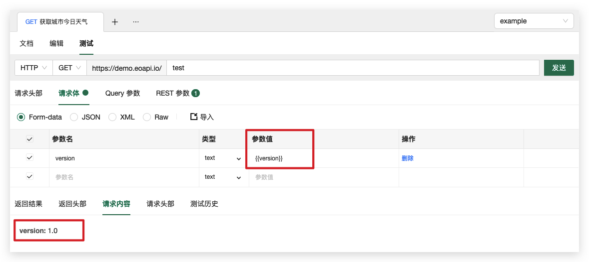

# 测试环境

设置 API 的请求地址前缀、全局变量信息。在测试时，可以一键切换测试环境而不需要手动输入域名。

我们可以通过环境下拉框新增环境


我们可以通过切换测试环境对 API 实现以下操作：

- 修改请求地址 URL
- 通过全局变量动态改变所有 API 的请求信息，例如 Query、Body 等参数



## 前置 URL

在测试时我们只需要选中相应的请求地址，测试时域名就会自动加到 API 路径前面，可以通过切换环境快速对开发、测试、线上环境的 API 进行测试


在 API 文档或测试中使用 {{环境变量参数名}} 的方式引用环境变量，在发送请求时会自动将环境变量替换为相应的值。

## 环境变量

环境变量常用于以下场景：

- 通过环境变量改变 API URL 里面的版本路径，比如
```text
api.eoapi.com/{{version}}/user/login
```
- 改变请求参数的 Key 和 Value，比如表单中有一个参数 version，值是环境变量：{{version}}


