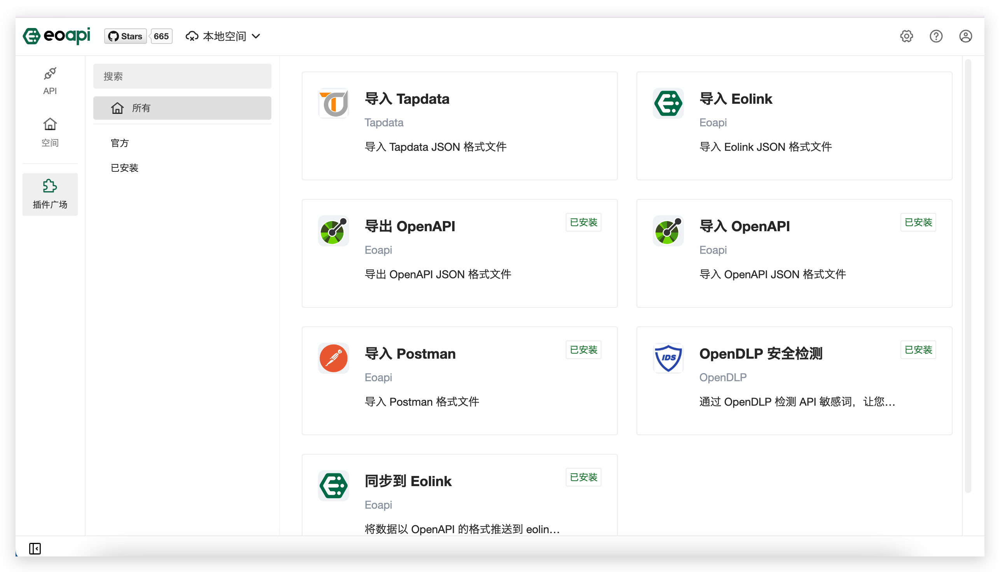
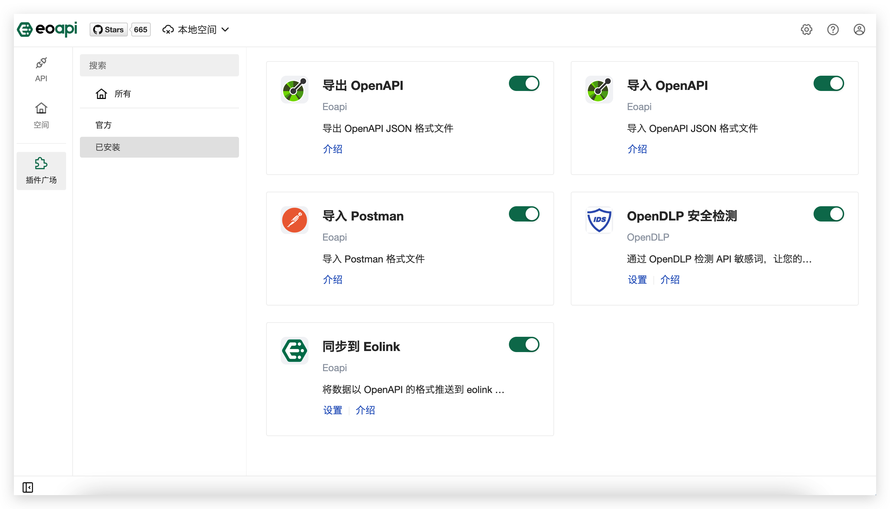
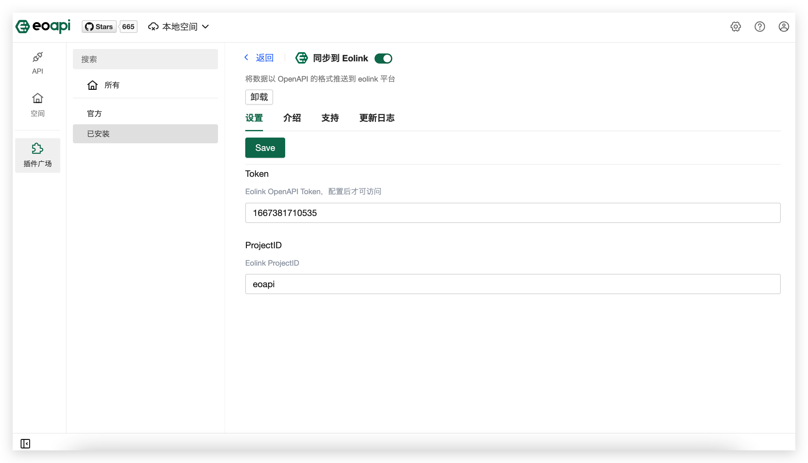

# 插件广场

插件机制是 Postcat 的主打功能，意在让用户根据自身的痛点，自由拓展、订制自己需要的功能。

不同的插件服务于不同的功能，很可能显示在不同的区域，也对应不同的 UI 和交互。

### 插件列表

所有插件列表

已安装插件列表

### 插件详情

插件设置

### 没有你想要的插件？

可以查看[开发者手册](https://developer.postcat.com/)开发、上架自己的插件。

也可以在 [Issue](https://github.com/Postcatlab/postcat/issues/137) 下给我们提建议
