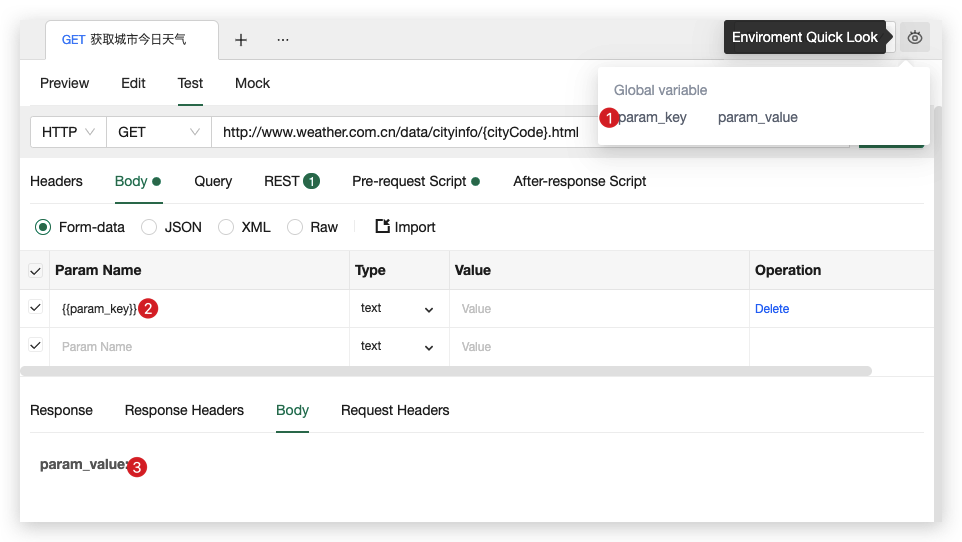
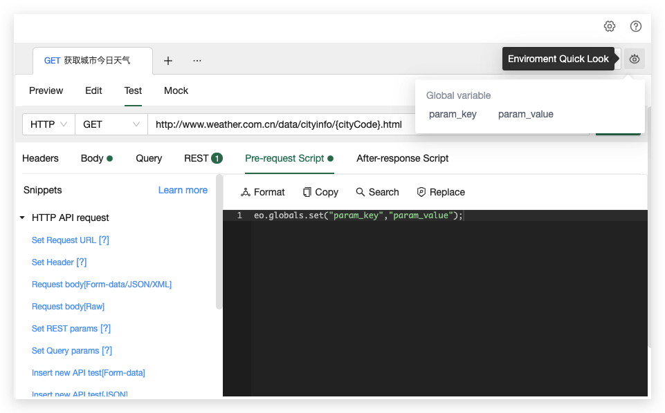

# 全局变量
全局变量可以在测试过程中动态取值以及赋值,可以在请求信息使用双花括号或者代码来引用该全局变量。


自定义全局变量有以下特性：
1. 自定义全局变量不依赖于环境，即使没有选择环境也可以使用。
3. 自定义全局变量仅储存在客户端中，清除浏览器缓存时也会把自定义全局变量清除。
4. 可以通过点击页面右上角预览环境按钮来查看当前的自定义全局变量值，如下图


## 脚本中操作全局变量
在代码中，可以通过以下语句对自定义全局变量操作：
```javascript
eo.globals.get(“variable_key”); //获取某个全局变量的值
eo.globals.set(“variable_key”,”variable_value”); //为某个全局变量赋值，注意值的类型只能是string、number、bool，除此之外会报错。
eo.globals.unset(“variable_key”); //清除某个全局变量
eo.globals.clear; //清除所有全局变量
```
