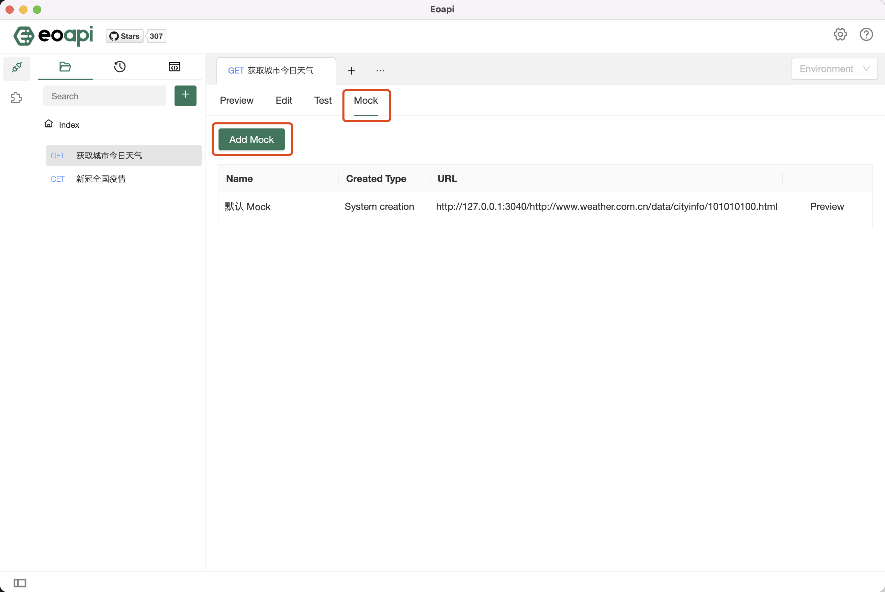
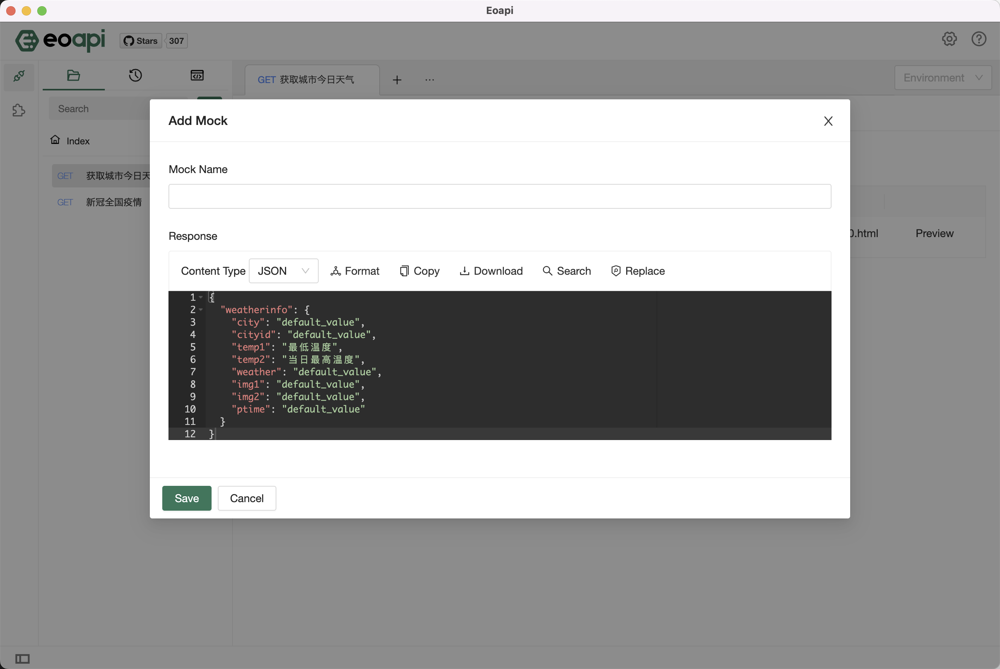
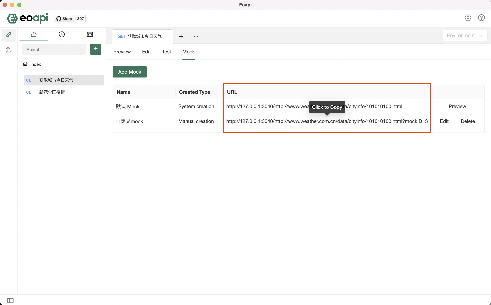

# Mock 功能使用介绍

接口尚未开发完成，在系统交互双方定义好接口之后，我们可以提前进行开发和测试，并不依赖上游系统的开发实现。
通过使用Mock模拟数据接口，我们即可在只开发了UI的情况下，无须服务端的开发就可以进行产品的演示。

## 创建 Mock

进入API文档详情页面，点击 Mock 标签，点击新建 Mock：

在弹窗中输入 Mock 的名称以及响应内容：

## 调用 Mock

进入 Mock 列表页面，点击调用地址即可复制到剪贴板，在代码中直接对该 API 地址发起请求即可得到响应结果。

