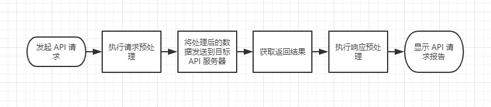

# 前后置脚本

脚本分为 前置脚本 和 后置脚本 两种，分别对应 API 请求前 和 返回数据后 的两个阶段。
您可以通过编写 Javascript 代码，在 API 前置脚本中改变请求参数，或者是在 API 后置脚本中改变返回结果。

> 脚本常用于以下几种情况：

- API 请求前对请求参数进行复制、加解密等操作，比如进行 Body 进行整体签名
- API 返回结果后对结果进行解密、断言等

发起的 API 请求会依次经过以下流程。其中如果您没有编写相应的 API 脚本，则会略过 API 脚本处理阶段。


## 内置函数

```
//输出信息
pc.info(data);

//中止测试并输出信息
pc.stop(data);

//断言失败并输出信息
pc.error(data);
```

## 函数说明

### pc.info(data);

**函数说明**
输出信息

**示例**


### pc.stop(data);

**函数说明**
中止测试并输出信息

**示例**


### pc.error(data);

**函数说明**
断言失败并输出信息

**示例**


### 全局变量

```javascript
pc.globals.get("variable_key"); //获取某个全局变量的值
pc.globals.set("variable_key", "variable_value"); //为某个全局变量赋值，注意值的类型只能是 string、number、bool，除此之外会报错。
pc.globals.unset("variable_key"); //清除某个全局变量
pc.globals.clear(); //清除所有全局变量
```
