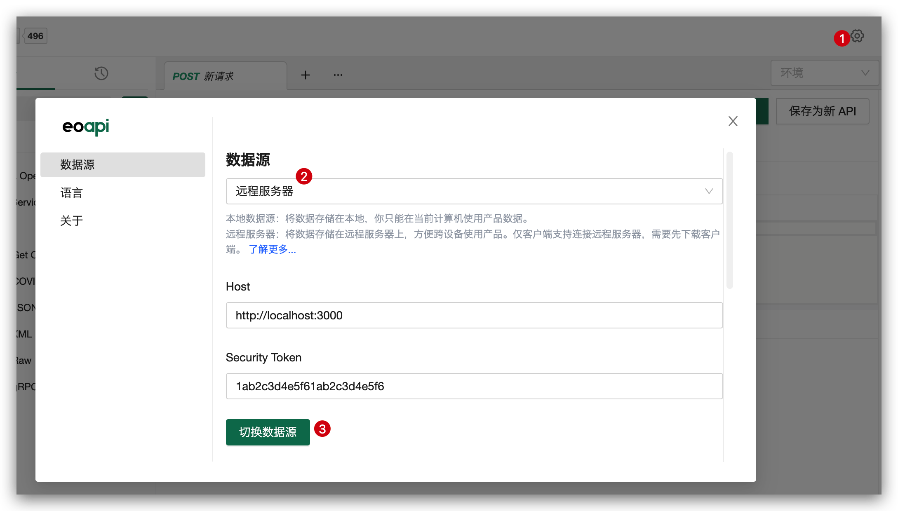

## 内网部署

Eoapi 提供两套数据源：

- 本地数据源：可单机/离线使用，IndexedDB 数据库
- 远程数据源：可远程协作，Node.js+MySQL

## 服务器部署

目前支持通过 Docker 安装部署应用，无需自己安装数据库 MySQL，一键即可部署成功。

## 服务端安装 Docker

> Docker 版本需高于 v20.10

- Docker [安装指南](https://www.runoob.com/docker/macos-docker-install.html)
- 调试可以使用[桌面端下载](https://www.docker.com/products/docker-desktop/)

### 服务部署

#### 1. 在服务器 Clone 仓库

```
git clone https://github.com/eolinker/eoapi-remote-server
```

#### 2. 环境变量配置

> _如果你没有配置数据库需求，可以[跳过此步骤](#_3-使用-docker-一键启动)，系统会使用默认配置启动_

在 `.env` 文件中统一配置 TOKEN 以及 MySQL 连接、端口等配置信息。

```bash
# auth token
API_KEY=1ab2c3d4e5f61ab2c3d4e5f6

# eoapi-server coinfigure
EOAPI_SERVER_PORT=3000

# mysql configure
TZ=Asia/Shanghai
# 映射到宿主机端口号
MYSQL_PORT=33066
MYSQL_USERNAME=root
MYSQL_DATABASE=eoapi
MYSQL_PASSWORD=123456a.
MYSQL_ROOT_PASSWORD=123456a.
```

默认情况下，在 `src/config/ormconfig.ts` 和 `docker-compose.yaml` 文件中统一使用了 `.env` 配置里的环境变量，比如：服务端口号、MySQL 连接等信息。

#### 3. 使用 Docker 一键启动

启动成功后，通过 `http://<server_url>:3000` 访问。

```bash
docker-compose up -d --build
```

#### 查看实时日志输出

如果需要查看运行日志，可以运行下面命令

```bash
docker-compose logs -f
```

### 服务升级

关闭服务后，运行迁移脚本，再重启服务即可。

```
npm run migration:run
```

## 客户端配置

点击设置，填入服务器地址、Token 后即可远程协作即可使用远程数据源。

