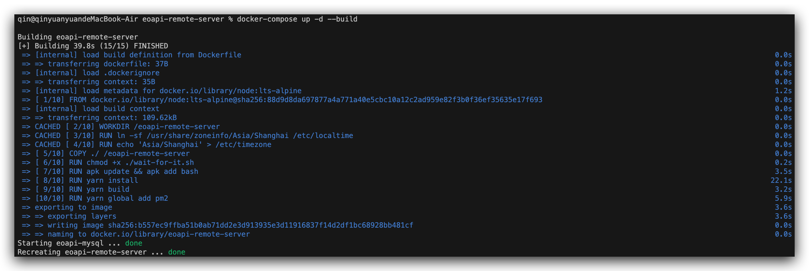
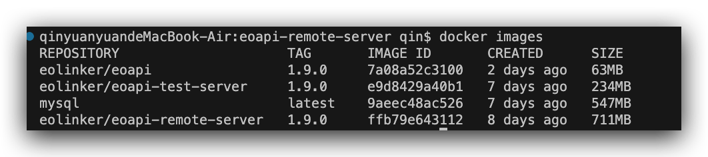
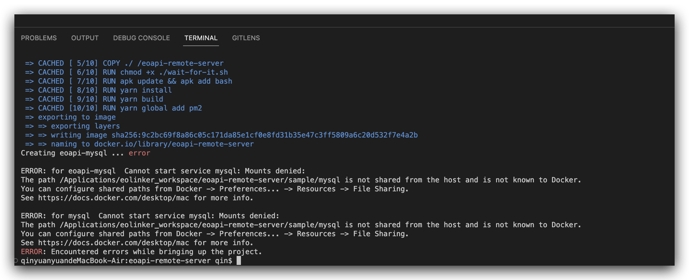
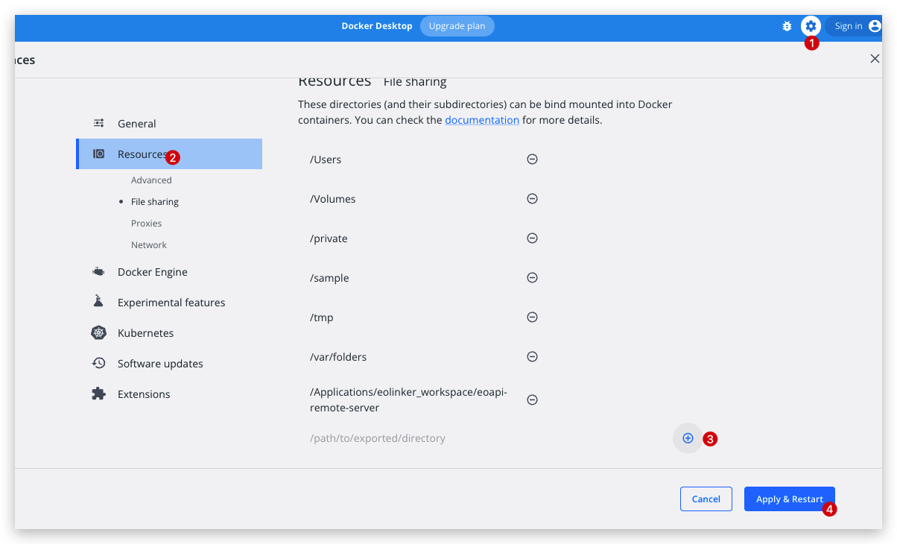

# 云端服务

我们可以通过配置云端服务将数据储存在云端，实现协作和共享数据。

## 服务部署

### 环境

服务依赖 Node.js，为了避免乱七八糟的环境问题，我们通过 Docker 安装部署应用。
所以在开始部署前，请准备好以下环境：

- Docker: 版本需高于 v20.10，可以参考[安装指南](https://www.runoob.com/docker/macos-docker-install.html)安装；
- Git：[安装指南](https://git-scm.com/book/zh/v2/%E8%B5%B7%E6%AD%A5-%E5%AE%89%E8%A3%85-Git)。

<!-- - 调试可以使用[桌面端下载](https://www.docker.com/products/docker-desktop/) -->

### 克隆仓库

在命令行运行以下命令拉取仓库代码

```
git clone https://github.com/eolinker/eoapi-remote-server
cd eoapi-remote-server
```

### 配置环境变量

:::warning
如果你不需要修改 MySQL 数据库配置，**可以[跳过此步骤](#服务运行)**，服务会将数据储存到容器内 MySQL。
:::

在根目录下 `.env` 文件中统一配置 MySQL 连接、端口等配置信息。

```bash
# Eoapi 服务配置
EOAPI_SERVER_PORT=3000
EOAPI_SERVER_PATH=/api

# MySQL 配置
TZ=Asia/Shanghai
# MySQL 的主机地址
# 如果连接的是其他 MySQL 服务器，填写实际地址例如  MYSQL_HOST=localhost
# 默认使用容器内部的 MySQL 地址是 host.docker.internal
MYSQL_HOST=host.docker.internal
# MySQL 端口号
MYSQL_PORT=33066
MYSQL_USERNAME=root
MYSQL_DATABASE=eoapi
MYSQL_PASSWORD=123456a.
MYSQL_ROOT_PASSWORD=123456a.
```

默认情况下，在 `src/config/ormconfig.ts` 和 `docker-compose.yaml` 文件中统一使用了 `.env` 配置里的环境变量，比如：服务端口号、MySQL 连接等信息。

## 服务运行

如果你的服务器可以联网，可以通过[在线部署](#在线部署)一键启动;

如果无法联网，请使用[离线部署](#离线部署)。

### 在线部署
:::warning
需要先在相应数据库创建数据表 eoapi（和配置文件写的表名保持一致）。
:::

在项目代码根目录下，运行下面命令。

```bash
docker-compose up -d
```

如图代表启动成功，可通过 `http://<server_url>:3002` 访问服务。


### 离线部署

> 需要先在有网的环境生成镜像，并导入内网`Docker`环境。

在仓库根目录下执行以下步骤：

#### 拉取镜像

```
docker-compose up -d
```

执行查看镜像是否拉取成功。

```bash
docker images
```

如图所示，镜像打包成功。


#### 导出镜像

导出制作好的镜像为本地文件。

```bash
# 语法格式： docker save {目标镜像} -o /{导出位置}/{导出镜像的名称}.tar
docker save eolinker/eoapi-remote-server -o ./eoapi-remote-server.tar
docker save eolinker/eoapi-test-server -o ./eoapi-test-server.tar
docker save eolinker/eoapi -o ./eoapi.tar
docker save mysql -o ./mysql
```

#### 导入镜像

在离线环境中导入镜像镜像文件。

```bash
docker load < ./eoapi-remote-server.tar
docker load < ./eoapi-test-server.tar
docker load < ./eoapi.tar
docker load < mysql -o ./mysql
```

#### 运行镜像

剩余步骤和[在线部署](#在线部署)一致。

## 部署成功！

部署完云端服务即可使用协作功能啦，将你部署好的服务器地址(一般是服务器 IP+3002 端口)分享给你的小伙伴吧!

客户端使用文档请看：[团队协作](/docs/collaborate.md)。

如果无法部署成功，请通过查看 [Docker logs](#查看实时日志输出) 日志排查问题。

## 服务升级

:::warning
升级前建议做好数据库备份
:::
停止正在运行的 Docker 服务，删除旧的 docker 镜像。

拉取 [eoapi-remote-server](https://github.com/eolinker/eoapi-remote-server)  仓库 `main` 分支最新的代码.

执行下面命令即可升级成功～

```
docker-compose down
docker image rm $(docker images | grep "eoapi" )
docker-compose up -d
```

## 服务监控

#### 查看实时日志输出

需要查看运行日志，可以运行下面命令

```bash
docker-compose logs -f
```

## FAQ
:::info
遇到问题请先[查看日志](#查看实时日志输出)～，如果仍然无法解决，可以[联系我们](/docs/contact.html)。
:::
## Docker 编排服务解析
Docker 一键部署后，会运行以下四个服务：
* eoapi：前端服务
* eoapi-remote-server：后端服务
* eoapi-test-server：测试服务，用于 web 端发起 API 测试
* mysql：数据库服务

部署时可以根据自己的需求修改 docker-compose 文件组合服务。

## 我如何在外部连接 Docker 里面的数据库？

Docker 里面的数据库开放了相应端口，.env 文件里面有默认配置，在数据库工具中填写[地址/端口/用户名/密码]直接连接即可

```
MYSQL_PORT=33066
MYSQL_USERNAME=root
MYSQL_DATABASE=eoapi
MYSQL_PASSWORD=123456a.
```

## Docker TLS handshake timeout

```shell
ERROR: Head "https://registry-1.docker.io/v2/library/mysql/manifests/latest": net/http: TLS handshake timeout
```

国外镜像的原因，可以打开代理或者国内镜像安装

## MacOS 系统 Docker is not shared from the host and is not known to Docker


配置 Docker 文件分享路径后，重启命令行再次执行命令即可解决

