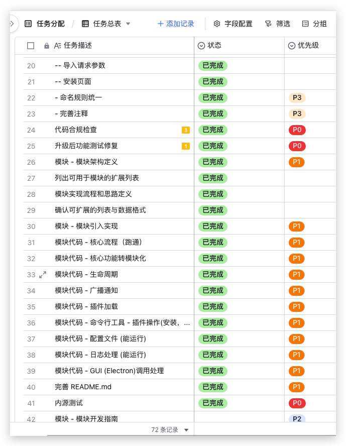
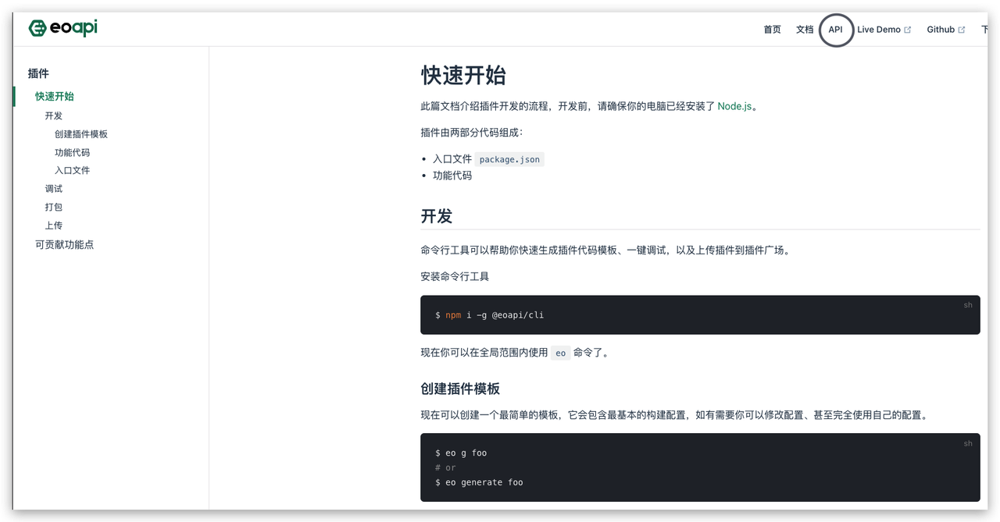
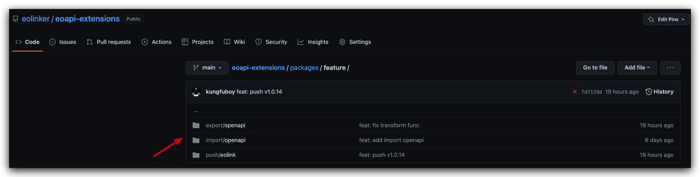

# 耗时半年，Eoapi 正式发布插件广场
这是我们的第一篇月报，每个月和每个来之不易的开发者分享产品故事以及产品进展。
在 5.20  这个极具中国特色的“节日”里，Eoapi 发布了 1.0.0 版，三个程序员掉了半年头发堆出了第一个正式版本。

把 Eoapi 介绍给大家的过程中，我们遇到的最多问题是：
> 你和 Postman 有什么区别？
Postman 出现的时间，是八年前，几乎是同类型 API 工具的祖师爷。
毋庸置疑它是一款优秀的产品，在那个使用 Curl、浏览器、抓包工具调试 API 的年代，这款支持通过界面对 API 发起测试的工具令人眼前一亮。
## 
那我们为什么还要做 Eoapi 呢？

### 1. 商业工具不够开放

商业工具不够开放，除非官方支持，否则很难和其他平台打通。
理想中的用户每天都在使用我们的产品解决任何问题，而实际上用户每天会和各种不同的工具打交道，并没有足够多的时间专注在使用你的产品。

所以足够简单，同时打磨核心功能，定义好产品的边界很重要。
我们不想做一个 All in one 的工具，如果没法满足用户的所有需求，那就**足够开放让用户选择按照他们喜欢的方式使用各个产品**。

**没有什么能比代码开源更开放了！**

所以从去年 11 月开始，我们开始立项、组团队开始做 Eoapi。

截图是我们的第一个用户，我在调研时问他：你期待的 API 工具是什么样子？

**他回答：希望各个工具不要做数据孤岛，能连通多个产品。**

如果说代码开源是我们开放的第一步，那第二步就是加入插件系统了。

如果只是代码开源，想要拓展功能仍然比较困难，我知道很多团队会选择在源代码的基础上二次开发，但当选择二次开发的那一刻起，可能就和后续的官方更新 say goodbye 了，对用户和官方来说都是一种损失，而插件系统就是解决这个问题的一个很好的方案。

插件系统让**开发者群体——一群极具创造力的人以更简单的方式参与共建，扩展功能、复用功能、碰撞更多可能。**

### 2. 团队需要本地部署 

商业产品数据一般放在云端，考虑到安全性，国内大多数公司会将 API 托管在自己的服务器，有资源的大公司造轮子，没资源的小团队使用开源工具改造改造。

Eoapi 可以单机使用，数据存储到本地，也支持在自己的服务器远程数据源，你完全可以把数据掌握在自己手里。

### 3. 更流畅的协作

Postman 功能比较垂直，单点功能设计很棒，但实际用于团队协作时功能操作逻辑不够连贯，也不够贴合国人开发协作场景。

国外的需求更偏向个体效率，而国内的需求更偏向于管理效率。如何在满足个体效率的同时贴合国内的管理效率，这是 Eoapi 想要找到的平衡。

我们不会说 Eoapi 是一款针对中国开发者研发的产品，我们的用户是所有开发者，不分国界。

我心目中真正好的 API 工具，远不止调试，还可以让开发者：
- 更快地开发更规范、更稳定的 API
- 在工具上记录的 API 数据发挥更大的价值
- 协作更加地顺畅

## 我们更新了什么？
太长不看版：
- Eoapi 上线插件广场
- Eoapi 支持系统设置
- 官方文档加入开发者文档
- 开发者命令行工具 @eoapi/cli 上线
- 支持 M1 内核 Mac 安装包

本月产品更新的主题是：一个插件的一生。

插件的【开发】->【调试】->【上传】->【上架】->【安装】->【使用】

## 插件系统
### 1. 插件广场
我们可以通过插件广场在应用中搜索、管理插件，目前有官方提供的两个插件：
- 导出 Swagger OpenAPI 格式插件
- 将 Eoapi 接口数据同步到 Eolink

可以通过反馈联系插件开发者建议需求、反馈缺陷

### 2. 开发者文档
开发者文档是开发者体验必不可少的一环，
> Eoapi 文档准则：说人话、目的清晰、用词准确、图文并貌、最好有示例

> ps：如果发现文档有误或者有改进建议，文档最下方可以提 Issue 或 Pull request 贡献此文档～

### 3. 插件代码示例
仓库地址：https://github.com/eolinker/eoapi-extensions

代码示例是了解一个插件文件结构最快速的方式，目前支持生成的功能模板：
- 导出插件
- 将 API 数据一键更新到其他平台

### 4. 开发者命令行工具
仓库地址：https://github.com/eolinker/eoapi-cli

我们可以通过命令行快速生成一个插件模板。

理论上来说，实现一个导出插件只需要：
- 配置一个入口文件
- 实现 API 数据转换的函数
  
除去函数实现时间，从配置到上传插件只需要 5 分钟。

## API 概况
可以在概况页
- 导出 API 数据
- 将 API 推送到其他平台：需要安装相关的插件
- 
后续计划和各大平台合作，因为产品起步期没有流量（弱弱地），合作推进会比较困难，所以先选择了 Eolink SaaS 产品进行合作，可以直接将 Eoapi 的接口同步到 Eolink 的某个项目。

相信随着用户数增加以及官方的努力，通过 API 数据打通的工具/平台会越来越多。

目前已知场景：
- 低代码平台：从 API 文档得到返回值格式，绑定低代码组件的字段
- API 网关：从 API 文档数据快速生成网关路由，减少手动录入的成本
- API 监控平台
- Mock 平台，例如 Mock Lab
- 云服务总线 ESB、CSB

**如果有其他场景，欢迎反馈，我们会及时响应（下面有微信群，当然上 github 提 Issue 更好～）**

## 系统设置
通过系统设置做一些个人的个性化设置，以及填写插件的所需的配置项。

## 其他
> # 号代表相应的 issue、pull request 编号
- 插件广场不需要 Node 支持 #36
- 环境优化 #42 #43
- 测试历史时间显示为空&&测试页滚动条错误 #22
- 拖动分组、API 无响应 #32
- 删除 API 显示失败 #27
- MacOS 系统 M1 内核支持

## 功能预告
6 月围绕协作功能、国际化实现功能拓展。
- 导入插件核心支持 —— 导入 Swagger、Postman、Eolink 等平台数据
- Mock —— 前端使用 Mock 协助联调
- 远程数据源 —— 数据源部署在自己的服务器，多人协作
- 多语言支持 —— 国际化支持
